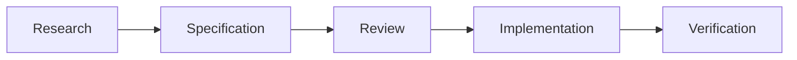

# AnatomIQ Documentation Standards Manual

| Field | Value |
| --- | --- |
| Document ID | AQ-STD-001 |
| Version | 0.1.0 |
| Status | Approved |
| Owner | AnatomIQ Project Team |
| Created | 2026-07-27 |
| Last updated | 2026-07-27 |
| Review cadence | Review at each major release or when this standard changes |
| Applies to | All Markdown documentation, decision records, plans, specifications, and prompts in this repository |

## Purpose

This manual defines how AnatomIQ documentation is created, reviewed, linked, and maintained. Its purpose is to make the repository useful to collaborators, medical reviewers, and AI coding agents over the lifetime of the project.

Documentation is a product asset and the source of truth for approved product, design, educational, and engineering decisions. Code and assets must implement the approved documentation; when a change is intentional, the relevant documentation must be updated as part of that change.

## Scope and governing principles

These standards govern all project documentation in `docs/`, supporting research notes in `research/`, and contributor-facing repository documents. They do not replace medical-source verification rules, which will be defined in the Medical Documentation Standards.

The following principles apply:

1. **Clarity before volume.** Write enough to remove meaningful ambiguity; do not add filler.
2. **Traceability before convenience.** Material decisions, claims, requirements, and changes must be attributable to a source or decision record.
3. **Accuracy before spectacle.** Educational and medical claims must not be made more dramatic at the cost of correctness.
4. **Documentation before implementation.** New significant features require an approved or explicitly accepted draft specification before implementation begins.
5. **One canonical term per concept.** Do not use competing names for the same feature, subsystem, or lesson.
6. **AI assistance is reviewed.** AI-generated content is a draft until a responsible reviewer verifies it against the relevant standards and sources.

## Documentation architecture

Documentation is organized by purpose, not by the person who wrote it.

| Location | Purpose |
| --- | --- |
| `docs/00-Constitution/` | Governing principles, documentation standards, and project-wide rules |
| `docs/01-Vision/` | Vision, mission, philosophy, and success criteria |
| `docs/02-Research/` | Research syntheses and reference indexes |
| `docs/03-PRD/` | Product requirements, personas, journeys, and release scope |
| `docs/04-UX/` | Information architecture, interaction flows, accessibility, and UX specifications |
| `docs/05-Design/` | Visual design system, motion, camera, and art direction |
| `docs/06-Engineering/` | Architecture, implementation specifications, interfaces, testing, and performance |
| `docs/07-Medical/` | Educational content, clinical review requirements, anatomy, and physiology specifications |
| `docs/08-AI/` | AI development workflow, prompt library, guardrails, and task templates |
| `docs/09-Decisions/` | Architecture and product decision records |
| `docs/10-Roadmap/` | Milestones, release plans, and dependency maps |
| `docs/11-Releases/` | Versioned release notes and retrospectives |
| `research/` | Source material, notes, and non-authoritative working research |

Files in `research/` are not product commitments. A conclusion becomes authoritative only when summarized, cited, and approved in the appropriate `docs/` document.

## Document identifiers and naming

Every governed document must have a stable Document ID. IDs remain unchanged when a document is renamed or moved.

### Identifier format

`AQ-<DOMAIN>-<NUMBER>`

| Domain | Meaning | Example |
| --- | --- | --- |
| `STD` | Documentation standards | `AQ-STD-001` |
| `CON` | Constitution or governance | `AQ-CON-001` |
| `VIS` | Vision and strategy | `AQ-VIS-001` |
| `PRD` | Product requirement | `AQ-PRD-001` |
| `UX` | User experience | `AQ-UX-001` |
| `DSN` | Design system or visual design | `AQ-DSN-001` |
| `ENG` | Engineering | `AQ-ENG-001` |
| `MED` | Medical or educational content | `AQ-MED-001` |
| `AI` | AI workflow or prompt standards | `AQ-AI-001` |
| `ADR` | Architecture decision record | `AQ-ADR-001` |
| `RDM` | Roadmap or release planning | `AQ-RDM-001` |

### File names

Use uppercase `SCREAMING_SNAKE_CASE` names with the `.md` extension for governed documents. Use a descriptive, stable noun phrase.

```text
PROJECT_CONSTITUTION.md
PRODUCT_VISION.md
CAMERA_SYSTEM.md
CARDIOVASCULAR_LESSON.md
ADR-001_SCROLL_DRIVEN_NARRATIVE.md
```

Do not use spaces, dates, author names, vague names such as `NOTES.md`, or version numbers in filenames. Put version information in the document metadata and revision history instead.

## Required document structure

Every governed document uses the following baseline template. Sections may be expanded, but required sections must not be removed without a documented reason.

```markdown
# <Document title>

| Field | Value |
| --- | --- |
| Document ID | AQ-<DOMAIN>-<NUMBER> |
| Version | 0.1.0 |
| Status | Draft |
| Owner | <role or team> |
| Created | YYYY-MM-DD |
| Last updated | YYYY-MM-DD |
| Review cadence | <event or interval> |
| Related documents | [Title](../path/FILE.md) |

## Purpose

<Why this document exists and the decision or work it supports.>

## Scope

### In scope

- <Included item>

### Out of scope

- <Excluded item>

## Requirements or content

<Domain-specific body.>

## Open questions

- [ ] <Resolvable question, owner, and target date if known.>

## Revision history

| Version | Date | Author/owner | Summary |
| --- | --- | --- | --- |
| 0.1.0 | YYYY-MM-DD | <role> | Initial draft. |

## Review checklist

- [ ] Metadata is complete and accurate.
- [ ] Scope and exclusions are explicit.
- [ ] Links and references work.
- [ ] Terminology matches the project glossary.
- [ ] Claims are appropriately sourced or marked as proposals.
- [ ] Open questions are current.
- [ ] AI Context is current.

## AI Context

| Item | Value |
| --- | --- |
| Objective | <What an AI should accomplish using this document> |
| Constraints | <Non-negotiable rules> |
| Inputs | <Required documents, data, or assets> |
| Outputs | <Expected implementation or artifact> |
| Do not assume | <Ambiguities an AI must not invent> |
| Validation | <Acceptance checks> |
```

### Metadata rules

- Dates use ISO 8601: `YYYY-MM-DD`.
- `Owner` is a role, team, or named accountable maintainer; do not use an AI model as an owner.
- `Related documents` uses relative Markdown links and includes only directly relevant material.
- `Review cadence` can be event-driven, such as “before public release” or “when lesson flow changes.”
- A document with unresolved high-impact medical, accessibility, security, or architectural questions cannot be marked Approved.

## Status lifecycle and versioning

### Status values

| Status | Meaning | Permitted use |
| --- | --- | --- |
| Draft | Work in progress; may change materially | Discussion and early implementation only when explicitly accepted by the owner |
| In Review | Ready for stakeholder review | No material changes without notifying reviewers |
| Approved | Accepted source of truth | Guides implementation and dependent documentation |
| Superseded | Replaced by a newer document or decision | Retained for history; links to replacement required |
| Deprecated | Still available but should not be used for new work | Must state the migration path |

### Version numbers

Use semantic document versions: `MAJOR.MINOR.PATCH`.

- **MAJOR**: a change that reverses or materially changes a prior approved decision.
- **MINOR**: new requirements, clarified scope, or meaningful additions that preserve the document’s direction.
- **PATCH**: wording, formatting, link, typo, or non-substantive correction.

The version and revision-history entry must be updated in the same change. Do not create a new filename solely to represent a version.

## Writing standards

Write for a new contributor, a domain reviewer, and a capable AI agent. Use plain, direct language.

- Prefer active voice: “The lesson engine displays labels” rather than “Labels are displayed.”
- Use “must” for a mandatory requirement, “should” for a strong recommendation, and “may” for an optional behavior.
- Separate facts, proposals, assumptions, and decisions. Label assumptions and proposals explicitly.
- State measurable criteria where possible: “maintain 60 FPS on the supported reference device” is better than “be fast.”
- Define abbreviations on first use, then use them consistently.
- Do not use marketing language, unexplained jargon, or subjective claims such as “beautiful,” “easy,” or “realistic” without a measurable definition.

### Canonical terminology

Until the glossary is published, use these terms consistently:

| Use | Avoid |
| --- | --- |
| AnatomIQ | AnatomIQ platform, AnatomyIQ, AnatomIQ app |
| Human Body Engine | body engine, renderer, anatomy engine |
| lesson | module, experience, page (unless referring to a literal web page) |
| learner | user, student, visitor, when the educational role matters |
| structure | organ, vessel, nerve, or anatomical feature when a general term is needed |
| annotation | label, tooltip, callout, when referring to the reusable UI concept |

## Markdown and visual conventions

### Headings

- Use exactly one H1 (`#`) per file.
- Do not skip heading levels.
- Use sentence case for headings.
- Keep headings descriptive and searchable.

### Lists, tables, and emphasis

- Use bullets for unordered items and numbered lists only for sequences.
- Use tables for comparison, ownership, status, mappings, and structured metadata.
- Use bold sparingly for essential terms; do not use bold as a substitute for headings.
- Use inline code for filenames, identifiers, commands, tokens, and literal UI labels.

### Code and configuration

Fence code blocks and specify a language whenever one is known.

```ts
const lessonId = "cardiovascular-circulation";
```

Use illustrative examples only. Mark intentionally incomplete code with a clear comment rather than presenting it as production-ready.

### Diagrams

Use Mermaid when a relationship, sequence, or hierarchy is easier to understand visually. Diagrams must have a short explanatory sentence and readable node labels.



Do not use diagrams as decoration. If a diagram expresses a normative workflow, explain its assumptions and link to the governing requirements.

### Images and assets

Store documentation images in a topic-specific `assets/` subdirectory using lowercase kebab-case filenames, for example `assets/concept-art/heart-closeup-v01.png`. Include alt text and a source or attribution where applicable. Do not commit copyrighted medical imagery unless the license permits it and the attribution is recorded.

## References and cross-references

Use relative links for internal documents. Link text must name the destination, not “here.”

```markdown
See [Project Constitution](PROJECT_CONSTITUTION.md) for project-wide principles.
```

External sources must include author or organization, title, publication date where available, URL, and access date if the content is changeable. Medical claims require reputable, traceable sources and later medical-review approval. A source list supports a claim; it does not automatically validate an interpretation.

## AI Context requirements

The `AI Context` section is an implementation handoff, not a summary of the whole document. Keep it concise, unambiguous, and current. It must identify the objective, non-negotiable constraints, required inputs, expected outputs, unknowns that must not be guessed, and validation criteria.

An AI agent must treat the following as blockers rather than inventing an answer:

- a missing medical source for a factual claim;
- an unresolved conflict between approved documents;
- an undefined acceptance criterion for a high-impact feature;
- a request that changes approved scope without an owner decision.

## Review and approval process

1. The owner creates or updates a Draft using the required template.
2. The owner verifies internal links, terminology, evidence, and acceptance criteria.
3. Relevant reviewers assess the document: product for scope, design for experience, engineering for feasibility, and medical reviewers for educational or clinical claims.
4. Review feedback is resolved or recorded as an explicit open question.
5. The owner updates metadata, revision history, and the checklist, then marks the document Approved.
6. The documentation change is committed with a focused message, for example: `docs: add documentation standards manual`.

For a small solo project, one person may hold multiple roles; the review steps still apply. High-risk medical content should receive an independent qualified review before public release.

## Examples

### Good requirement

> The cardiovascular lesson must provide a pause control that freezes the story timeline, camera movement, blood-flow animation, and narration while preserving the learner’s current step.

This specifies behavior, scope, and a testable outcome.

### Weak requirement

> Add a nice pause button.

This leaves purpose, behavior, scope, and acceptance criteria undefined.

### Good cross-reference

> The camera behavior is defined in [Camera System](../05-Design/CAMERA_SYSTEM.md); this document defines only the learner-facing lesson requirement.

### Good AI Context entry

| Item | Value |
| --- | --- |
| Objective | Implement the pause behavior described in this requirement. |
| Constraints | Do not reset the active lesson step or desynchronize narration. |
| Do not assume | Keyboard shortcut, icon design, or analytics event names. |
| Validation | Pause at three points in the lesson and verify every time-based subsystem stops and resumes from the same state. |

## Revision history

| Version | Date | Author/owner | Summary |
| --- | --- | --- |
| 0.1.0 | 2026-07-27 | AnatomIQ Project Team | Initial documentation standards manual. |

## Review checklist

- [x] Metadata is complete and accurate.
- [x] Scope and exclusions are explicit.
- [x] Naming, status, versioning, and template rules are defined.
- [x] Markdown, reference, and AI Context conventions are defined.
- [x] Examples and a reusable review checklist are included.
- [x] No external factual or medical claims require citation in this governance document.

## AI Context

| Item | Value |
| --- | --- |
| Objective | Create and maintain all AnatomIQ documentation in a consistent, reviewable format. |
| Constraints | Apply the required metadata, structure, naming, lifecycle, revision history, review checklist, and AI Context section. |
| Inputs | This manual and the relevant domain documentation. |
| Outputs | A governed Markdown document that can be reviewed by humans and used by AI agents without inventing missing requirements. |
| Do not assume | Medical facts, unapproved product decisions, undocumented dependencies, or implementation details absent from approved specifications. |
| Validation | Confirm required sections exist, links resolve, terminology is consistent, claims are sourced or marked, and revision history matches the document version. |
