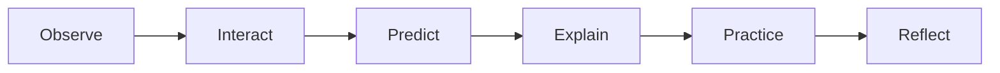

# AnatomIQ Project Constitution

| Field | Value |
| --- | --- |
| Document ID | AQ-CON-001 |
| Version | 0.1.0 |
| Status | Approved |
| Owner | AnatomIQ Project Team |
| Created | 2026-07-27 |
| Last updated | 2026-07-27 |
| Review cadence | Before each major release and whenever a principle is proposed for change |
| Related documents | [Documentation Standards Manual](DOCUMENTATION_STANDARDS.md) |

## Purpose

This Constitution defines the non-negotiable principles that guide AnatomIQ. It is the decision compass for product scope, medical content, user experience, visual design, engineering, data, and AI-assisted work.

When a proposal conflicts with this Constitution, the proposal must be changed, explicitly approved as an exception, or rejected. Convenience, novelty, visual impact, and implementation speed do not override these principles.

## Scope

### In scope

- All AnatomIQ product and educational experiences.
- All documentation, code, assets, models, prompts, data, and releases created for AnatomIQ.
- Decisions made by project contributors, contractors, collaborators, and AI agents.

### Out of scope

- Clinical diagnosis, treatment decisions, emergency guidance, or individualized medical advice.
- Claims that AnatomIQ is a substitute for qualified instruction, a textbook, or professional healthcare.

## Definitions

| Term | Meaning |
| --- | --- |
| learner | A person using AnatomIQ to explore and understand anatomy or physiology. |
| lesson | A structured, interactive learning experience with objectives, visualizations, explanation, and assessment. |
| medical claim | A statement about anatomy, physiology, pathology, diagnosis, treatment, or clinical relevance. |
| approved documentation | A document marked `Approved` under the status lifecycle in `AQ-STD-001`. |
| exception | A time-bounded, documented decision to depart from a constitutional principle. |

## Articles

### Article I — Educational value comes before visual spectacle

Every animation, interaction, camera movement, sound, and visual effect must support a stated learning objective. Visual polish is valuable only when it improves comprehension, attention, orientation, recall, or safe exploration.

**Required practice**

- Each lesson identifies measurable learning objectives before production.
- Decorative effects must not obscure structures, labels, or sequence.
- If an effect creates confusion or reduces accessibility, it must be removed or made optional.

**Decision test:** Can the team explain what a learner understands better because this element exists?

### Article II — Scientific integrity is mandatory

AnatomIQ must not present inaccurate, misleading, or oversimplified medical content as fact. Simplification is allowed only when its purpose and limits are explicit and it does not reverse the underlying concept.

**Required practice**

- Medical claims are traceable to reputable sources.
- Educational content distinguishes normal physiology, simplified teaching models, and pathology simulations.
- Content intended for public release undergoes review appropriate to its clinical sensitivity.
- Uncertain or evolving claims are labelled accordingly or excluded.

**Decision test:** Would a qualified reviewer be able to trace and evaluate the claim and its visual representation?

### Article III — AnatomIQ teaches through active understanding

Lessons must give learners meaningful opportunities to observe, interact, predict, explain, and check understanding. Passive watching can support a lesson but cannot be its sole learning method.

The default learning loop is:

**Required practice**

- Each lesson provides an explicit learning goal.
- Interactions have clear feedback and educational purpose.
- Knowledge checks assess the lesson’s objectives rather than unrelated memorization.
- Learners can pause, replay, and revisit essential information.

### Article IV — The product respects learner agency

Learners control pace, orientation, and access to support. Scroll-driven storytelling must guide attention without trapping people in an animation or withholding essential content.

**Required practice**

- Essential explanations remain available without requiring precise scrolling or pointer control.
- Time-based sequences provide pause, replay, and restart behavior.
- Navigation makes the learner’s current location and available next actions clear.
- The experience never relies solely on surprise, motion, or sound to communicate required information.

### Article V — Accessibility is a release requirement

Accessibility is built into requirements, design, implementation, and testing. It is not a post-release enhancement.

**Required practice**

- Essential flows are usable with keyboard input.
- Color is never the only way to communicate blood oxygenation, state, selection, or urgency.
- Motion-sensitive learners can reduce or disable non-essential motion.
- Text, controls, contrast, and focus states meet the project’s accessibility specification.
- Alternative explanations are provided when a 3D visualization alone cannot communicate a concept accessibly.

**Decision test:** Can a learner with different input, vision, hearing, motion, or processing needs complete the learning objective?

### Article VI — The Human Body Engine is reusable and data-driven

The core platform must support multiple systems and lessons without copying or hardcoding lesson-specific behavior into the engine. The cardiovascular MVP validates the engine; it does not define its boundaries.

**Required practice**

- Lesson steps, annotations, camera states, interactions, and assessments are represented as data where practical.
- Shared systems expose stable, documented interfaces.
- A new lesson should be added primarily by authoring validated content and assets, not by duplicating application logic.
- Reuse must not conceal medically meaningful differences between systems.

### Article VII — Performance protects learning

Performance is part of the experience. Delays, unstable frame rates, uncontrolled resource use, and camera glitches break concentration and can make the learning model harder to understand.

**Required practice**

- Performance budgets are defined before high-fidelity assets and effects are accepted.
- The experience is tested on supported reference hardware, not only a developer workstation.
- Assets use appropriate loading, compression, level-of-detail, and fallback strategies.
- Failure states preserve learner progress and provide a usable alternative where possible.

### Article VIII — Privacy and trust are designed in

AnatomIQ collects only data that is necessary to operate, improve, or explicitly requested by the learner. The product must be transparent about data use and avoid manipulative engagement patterns.

**Required practice**

- New data collection requires a documented purpose, retention approach, and consent or lawful basis as applicable.
- Educational analytics are aggregated or minimized where possible.
- Personal health information is not required for core learning experiences.
- AI features must disclose their limits and must not imply clinical authority.

### Article IX — Documentation precedes material implementation

Approved documentation is required before implementing material features, interfaces, or content. The documentation must describe intent, scope, constraints, acceptance criteria, and dependencies at a level suitable for the work.

**Required practice**

- Significant changes update relevant documentation in the same change set.
- Conflicts between documents are resolved through a decision record before implementation proceeds.
- Work that follows a Draft must state that dependency and obtain owner acceptance.
- Documentation remains concise enough to stay useful; it is not created merely to increase page count.

### Article X — AI accelerates work; humans retain accountability

AI agents may draft, analyze, implement, test, or review work under explicit constraints. A responsible human remains accountable for approving decisions, verifying outputs, and protecting the project’s standards.

**Required practice**

- AI prompts identify the relevant specifications, constraints, and expected validation.
- AI-generated medical content is not accepted without source verification and appropriate review.
- AI agents must not invent unresolved requirements, sources, permissions, or test results.
- Generated code and documentation are reviewed against acceptance criteria before merge.

### Article XI — The project is honest about scope and readiness

AnatomIQ must accurately communicate what is implemented, simulated, reviewed, experimental, and planned. Aspirational capabilities must not be described as available product functionality.

**Required practice**

- Roadmaps distinguish committed scope from exploration.
- Demos identify simplified models and known limitations.
- Release notes document material changes, limitations, and unresolved risks.
- Marketing and portfolio material must not overstate medical validation or learning outcomes.

### Article XII — Decisions are reversible where possible and recorded when consequential

The team should favor incremental, testable decisions with clear rollback paths. Decisions that constrain architecture, medical representation, accessibility, privacy, or long-term product direction require a written record.

**Required practice**

- Record consequential decisions in `docs/09-Decisions/` using an ADR or Product Decision Record.
- State the context, decision, alternatives, trade-offs, and consequences.
- Revisit decisions when their assumptions change.
- Do not reopen accepted decisions without new evidence, a changed constraint, or a material defect.

## Conflict resolution and exceptions

When principles appear to conflict, apply them in this order:

1. Scientific integrity and learner safety.
2. Accessibility, privacy, and trust.
3. Educational value and learner agency.
4. Reusability and performance.
5. Delivery speed and visual polish.

An exception requires a written decision record that identifies the affected article, the reason, alternatives considered, risk, mitigation, accountable owner, and expiry or review date. Exceptions must be narrowly scoped and cannot silently become permanent policy.

## Decision checklist

Before approving a significant feature or content change, answer:

- [ ] Which learning objective does this support?
- [ ] Are all medical claims accurate, scoped, and traceable?
- [ ] Can learners access the essential information without relying on a single input method, color cue, or animation?
- [ ] Does the proposal protect learner control, privacy, and trust?
- [ ] Does it fit the reusable Human Body Engine rather than create avoidable one-off logic?
- [ ] Are performance impact and fallback behavior understood?
- [ ] Is the specification approved or explicitly accepted as a Draft?
- [ ] Does an ADR or exception record need to be created?

## Amendment process

This Constitution changes only when the project’s long-term principles require it. Amendments must:

1. describe the problem with the current wording;
2. identify affected documents, features, and releases;
3. propose the exact change and alternatives;
4. assess consequences for scientific integrity, accessibility, privacy, learning, and engineering;
5. be recorded in the revision history and, when material, in a decision record.

## Revision history

| Version | Date | Author/owner | Summary |
| --- | --- | --- | --- |
| 0.1.0 | 2026-07-27 | AnatomIQ Project Team | Initial project constitution. |

## Review checklist

- [x] Metadata, scope, and definitions are complete.
- [x] Principles cover educational value, medical integrity, accessibility, agency, reusability, performance, privacy, documentation, AI, honesty, and decisions.
- [x] A conflict-resolution and exception process is defined.
- [x] The decision checklist supports practical application.
- [x] No external medical claim is made without a future source requirement.
- [x] AI Context is complete.

## AI Context

| Item | Value |
| --- | --- |
| Objective | Evaluate proposed AnatomIQ work against the governing principles before creating or modifying product, design, engineering, or medical artifacts. |
| Constraints | Do not trade scientific integrity, accessibility, privacy, learner agency, or approved scope for speed or visual impact. |
| Inputs | This Constitution, `AQ-STD-001`, and all directly relevant approved specifications. |
| Outputs | A proposal, implementation, review, or decision record that identifies the applicable articles and satisfies the Decision Checklist. |
| Do not assume | Medical accuracy, learner consent, accessibility compliance, performance capacity, or approval of a Draft document. |
| Validation | Confirm the work supports a stated learning objective, is documented, is accessible, respects privacy, fits the engine strategy, and has appropriate evidence or review. |
