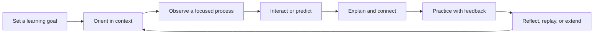

# AnatomIQ Educational Philosophy

| Field | Value |
| --- | --- |
| Document ID | AQ-VIS-003 |
| Version | 0.1.0 |
| Status | Draft |
| Owner | AnatomIQ Project Team |
| Created | 2026-07-27 |
| Last updated | 2026-07-27 |
| Review cadence | Before MVP content approval and whenever lesson or assessment standards change |
| Related documents | [Project Vision](PROJECT_VISION.md), [Mission](MISSION.md), [Product Philosophy](PRODUCT_PHILOSOPHY.md), [Project Constitution](../00-Constitution/PROJECT_CONSTITUTION.md) |

## Purpose

This document defines how AnatomIQ approaches learning design. It establishes the principles that turn medical content and 3D visualization into understandable, responsible, and reusable educational experiences.

The philosophy guides lesson authors, designers, engineers, reviewers, and AI agents. It does not replace detailed lesson specifications, research plans, medical review, or accessibility requirements.

## Scope

### In scope

- Learning principles for interactive anatomy and physiology lessons.
- Lesson structure, objective design, explanation, practice, feedback, and reflection.
- Responsible simplification, learner control, and accessibility considerations.

### Out of scope

- Claims that AnatomIQ independently certifies learning outcomes.
- Formal curriculum accreditation, examination alignment, or clinical competency assessment.
- Detailed medical-content sources and reviews for individual lessons.

## Educational philosophy statement

**AnatomIQ helps learners build durable mental models by connecting what they see, what changes over time, what it means, and how they can verify their own understanding.**

Learning is not treated as exposure to information. It is the active process of organizing relationships, testing understanding, receiving feedback, and returning to difficult ideas with better context.

## Learning model

AnatomIQ uses a repeatable learning cycle for every system lesson:

| Stage | Educational purpose | Example in a circulation lesson |
| --- | --- | --- |
| Set a learning goal | Clarify what the learner should be able to explain. | “Trace the route of deoxygenated blood from the body to the lungs.” |
| Orient in context | Establish body location, system, and relevant structures. | Show the heart between the lungs and identify the right side of the heart. |
| Observe a focused process | Direct attention to one comprehensible event. | Show blood entering the right atrium. |
| Interact or predict | Ask the learner to inspect, control, or anticipate. | Ask which valve blood passes through next. |
| Explain and connect | Give accurate meaning to what was observed. | Explain the role of the tricuspid valve in one-way flow. |
| Practice with feedback | Check understanding and correct misconceptions. | Ask the learner to order the next route segments. |
| Reflect, replay, or extend | Support consolidation and next-step learning. | Replay the pulmonary circuit or continue to oxygenated return. |

The cycle is a design framework, not a rigid script. A short lesson step may combine stages, but a complete lesson must provide orientation, explanation, learner agency, and a way to check or revisit understanding.

## Educational principles

### 1. Begin with a measurable learning objective

Every lesson and major step must state what the learner should be able to do after completing it. Objectives should use observable actions such as identify, locate, trace, compare, explain, predict, or distinguish.

Avoid objectives that cannot be assessed, such as “understand the heart.” Prefer: “Trace blood through the four heart chambers and identify which side carries deoxygenated blood.”

### 2. Build a mental model before demanding recall

Learners remember vocabulary and sequences more reliably when they can attach them to a coherent representation. AnatomIQ should introduce structure, location, direction, and function before asking learners to reproduce names or routes.

### 3. Manage cognitive load deliberately

Complex anatomy can overwhelm attention when too many structures, labels, movements, controls, and explanations appear together. The product should reduce unnecessary load while preserving the complexity needed for the objective.

**Required practice**

- Reveal labels and details progressively.
- Keep one primary event or question in focus at a time.
- Use visual hierarchy to distinguish the essential structure from background context.
- Avoid presenting a new interaction, new vocabulary, and complex motion simultaneously without support.
- Allow learners to pause and repeat steps before introducing the next relationship.

### 4. Pair visualization with explanation

Visuals do not explain themselves. A representation must be supported by concise language, annotation, narration where appropriate, and meaningful feedback. Conversely, text should point to evidence the learner can inspect.

For each important visual sequence, lesson authors must define:

- what the learner should notice;
- what the sequence represents;
- what it intentionally simplifies or omits;
- the misconception it is designed to prevent.

### 5. Use retrieval and prediction as learning tools

Low-stakes questions, ordering tasks, comparisons, and predictions help learners identify gaps in their model. Practice should appear throughout a lesson, not only as a final quiz.

**Required practice**

- Ask questions that map directly to the current or previous objective.
- Give feedback that explains the reasoning, not only whether the response was correct.
- Permit retry and link feedback back to the relevant visual step.
- Avoid trick questions and avoid measuring knowledge that was never taught.

### 6. Treat mistakes as useful evidence

An incorrect response indicates a possible misconception, not a learner failure. Feedback should help the learner revise their model and know where to look next.

Good feedback is specific: “Blood from the body enters the right atrium first; the left atrium receives oxygenated blood returning from the lungs.”

Weak feedback is generic: “Incorrect. Try again.”

### 7. Use repetition with variation

Important relationships should reappear in different but connected forms: a guided visual story, an annotation, a prediction, a knowledge check, and a summary. Repetition should reinforce the same model rather than repeat the same sentence.

### 8. Use simplification responsibly

Every educational representation is selective. AnatomIQ may simplify scale, timing, branching, visual density, or terminology to make an objective teachable. It must not use simplification in a way that teaches an incorrect causal relationship or conceals an important limitation.

When relevant, identify simplifications through language such as “This view highlights the major route” or “For clarity, smaller branches are not shown.”

### 9. Design for accessibility and varied learning needs

The same core concept should be available through more than one channel whenever practical: visual structure, readable text, controls, descriptions, captions, and reduced-motion or step-based presentation.

Accessibility alternatives must preserve the learning objective, not merely offer a disclaimer that the visual experience is unavailable.

### 10. Respect learner context and sensitive subjects

Body systems can involve sensitive topics, varied prior knowledge, disability, health anxiety, and cultural context. AnatomIQ uses neutral, precise, inclusive language and avoids assumptions about bodies, gender, health status, or personal experience.

## Anatomy lesson blueprint

Every full lesson specification should contain the following elements.

| Element | Requirement |
| --- | --- |
| Learner level | State assumed prior knowledge and vocabulary. |
| Learning objectives | Use observable, assessable actions. |
| Prerequisites | List concepts or lessons required for success. |
| Essential model | Describe the minimum accurate model being taught. |
| Visual sequence | Identify each major scene, structure, movement, and focus cue. |
| Explanation | State what each step means and its intended takeaway. |
| Interaction | Define the learner action, purpose, and response. |
| Practice | Map questions or tasks directly to objectives. |
| Feedback | Explain correct reasoning and common misconception paths. |
| Simplifications | State important omissions, compression, or teaching conventions. |
| Accessibility | Define equivalent access to essential concepts. |
| Review | Identify required medical, educational, and usability review. |

## Assessment guidance

AnatomIQ assessments are formative by default: they help the learner and product determine whether the explanation was clear enough.

| Use | Appropriate approach | Avoid |
| --- | --- | --- |
| Identify a structure | Ask the learner to locate or select it in context. | Asking a name without showing context when the objective is spatial understanding. |
| Trace a process | Ask for sequence, direction, or next destination. | Testing a route not shown in the lesson. |
| Explain function | Ask for cause-and-effect reasoning in plain language. | Treating a memorized phrase as proof of understanding. |
| Compare structures | Present a meaningful visual or functional contrast. | Comparing irrelevant details only to make a question difficult. |
| Address misconception | Give targeted feedback and a revisitable explanation. | Marking an answer wrong with no explanation or path back. |

Scores, completion, and interaction data must not be represented as clinical competence, professional readiness, or a medical judgment.

## Responsible use of AI in educational content

AI may assist with drafts, scaffolds, question variants, summaries, and consistency checks. It must not become an unreviewed source of medical truth.

Before accepting AI-assisted educational content:

- verify factual claims against appropriate sources;
- confirm the content matches the approved learning objective;
- check that language is clear, inclusive, and non-diagnostic;
- validate question-answer pairs and explanations;
- identify any assumptions or simplifications the AI introduced.

## Lesson quality checklist

- [ ] The learner level and prior knowledge are stated.
- [ ] Learning objectives are specific and assessable.
- [ ] Orientation establishes the relevant body and system context.
- [ ] The visual sequence has one clear primary idea at each step.
- [ ] Labels, animation, and language reinforce rather than compete with each other.
- [ ] Interactions and practice map directly to objectives.
- [ ] Feedback explains reasoning and supports retry or review.
- [ ] Simplifications, limitations, and uncertain claims are identified.
- [ ] Essential learning content remains available with accessible alternatives.
- [ ] Medical and educational review needs are stated.

## Open questions

- [ ] What learner-research methods will be feasible for validating the cardiovascular MVP lesson loop?
- [ ] Which objective taxonomy should be used consistently across future lesson specifications?
- [ ] What is the minimum viable accessible alternative for highly spatial 3D interactions?
- [ ] How should lessons communicate different depth levels without duplicating medical content?

## Revision history

| Version | Date | Author/owner | Summary |
| --- | --- | --- | --- |
| 0.1.0 | 2026-07-27 | AnatomIQ Project Team | Initial educational philosophy draft. |

## Review checklist

- [x] Educational philosophy statement and learning model are defined.
- [x] Objective design, cognitive load, practice, feedback, repetition, and simplification principles are covered.
- [x] Accessibility and sensitive-subject considerations are included.
- [x] A reusable lesson blueprint and quality checklist are included.
- [x] AI-assisted educational-content safeguards are stated.
- [x] AI Context is complete.

## AI Context

| Item | Value |
| --- | --- |
| Objective | Create, evaluate, or revise AnatomIQ lessons so learners build an accurate mental model through orientation, focused observation, purposeful interaction, explanation, practice, and reflection. |
| Constraints | Define measurable objectives; manage cognitive load; never present unsupported medical claims; state simplifications; make essential concepts accessible; use assessment as formative feedback. |
| Inputs | This document, the Project Constitution, relevant medical sources and specifications, the Product Philosophy, and the lesson’s learner-level definition. |
| Outputs | A lesson specification, scene plan, interaction plan, assessment item, or feedback design mapped directly to approved learning objectives. |
| Do not assume | That a 3D view inherently teaches, that an AI-generated explanation is accurate, that a quiz score proves competence, or that simplifications need no disclosure. |
| Validation | Complete the Lesson Quality Checklist; verify every question was taught by the lesson; confirm visual and textual explanations agree; obtain the required medical and educational reviews. |
