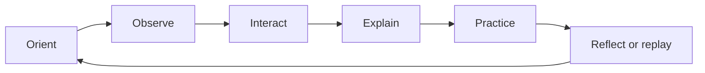

# AnatomIQ Product Philosophy

| Field | Value |
| --- | --- |
| Document ID | AQ-VIS-002 |
| Version | 0.1.0 |
| Status | Draft |
| Owner | AnatomIQ Project Team |
| Created | 2026-07-27 |
| Last updated | 2026-07-27 |
| Review cadence | Before MVP scope approval and whenever core interaction patterns change |
| Related documents | [Project Vision](PROJECT_VISION.md), [Mission](MISSION.md), [Project Constitution](../00-Constitution/PROJECT_CONSTITUTION.md) |

## Purpose

This document defines the product principles that shape AnatomIQ’s learner experience. It guides choices about what to build, how to present information, where to introduce interaction, and what the product should deliberately avoid.

The Project Constitution establishes non-negotiable governance. This philosophy explains how those commitments become a coherent product.

## Scope

### In scope

- Experience principles for AnatomIQ lessons and navigation.
- Product behaviors that promote comprehension, agency, and trust.
- Feature trade-offs and anti-patterns.

### Out of scope

- Detailed UI specifications, visual styling, or technical architecture.
- A complete educational methodology or medical content policy.
- Individual feature acceptance criteria.

## Philosophy statement

**AnatomIQ is a guided exploration tool: it helps learners build understanding by making the body’s relationships visible, then giving them the control and context needed to reason about what they see.**

The product should feel like a knowledgeable guide beside a learner—not a passive film, a dense textbook, or an uncontrolled 3D sandbox.

## Product principles

### 1. Orient before explaining

Learners need a sense of location before detail. Every lesson should establish where the learner is in the body, which system is in focus, and how the current structure connects to the larger whole.

**Implications**

- Start with whole-body or system-level context when it meaningfully aids orientation.
- Preserve a path back to broader context from focused views.
- Use clear spatial cues, landmarks, and titles before introducing complex labels.

### 2. Tell one understandable story at a time

A lesson may contain rich information, but its primary sequence must remain legible. The learner should know what is happening now, what caused it, and why the next step follows.

**Implications**

- A single step has one primary teaching purpose.
- Supporting detail is available on demand rather than competing with the main sequence.
- Story progression makes direction and causality explicit, especially for flow-based processes.

### 3. Interaction must earn its place

Interactions are valuable when they help a learner inspect, compare, predict, control pace, or demonstrate understanding. Interaction that only decorates a scene, creates friction, or rewards random clicking should not be part of the core lesson.

**Implications**

- Use scroll, click, hover, keyboard, and direct manipulation only where their role is clear.
- Provide visible feedback for every meaningful interaction.
- Never hide required learning content behind a precision gesture or unexplained control.

### 4. Keep explanation adjacent to evidence

When learners see a structure or process, the relevant explanation should be available at that moment and in that context. Avoid forcing learners to remember a distant paragraph while interpreting a complex scene.

**Implications**

- Attach annotations to the relevant structure or lesson step.
- Use concise first explanations; offer deeper detail progressively.
- Connect labels to function rather than presenting terminology without purpose.

### 5. Control pace without breaking flow

The product should guide attention through a coherent sequence while allowing learners to pause, replay, revisit, and choose a manageable pace. No learner should be punished for stopping to understand.

**Implications**

- Time-based lessons must preserve state on pause and resume.
- Navigation indicates progress and makes revisiting earlier steps predictable.
- Reduced-motion and non-animated representations preserve the core lesson meaning.

### 6. Reveal complexity progressively and honestly

The body is complex. AnatomIQ should begin with the minimum model needed to teach the objective, then offer deeper layers without pretending the simplified model is complete.

**Implications**

- Clearly distinguish essential structure from optional detail.
- State meaningful simplifications and omissions where they could change interpretation.
- Add complexity only when it advances the stated learning objective.

### 7. Use assessment as feedback, not judgment

Knowledge checks help learners discover what they understand and what needs review. They are part of the learning loop, not a gatekeeping mechanism or a source of anxiety.

**Implications**

- Questions map directly to the lesson’s learning objectives.
- Feedback explains why an answer is correct or incomplete.
- Learners can revisit the relevant visual explanation after answering.
- Scores are not treated as clinical, academic, or professional competency evidence.

### 8. Build trust through calm precision

The product’s language, motion, visual hierarchy, and limitations should communicate confidence without exaggeration. AnatomIQ earns attention by being clear and useful, not by manufacturing urgency or gamified pressure.

**Implications**

- Avoid manipulative countdowns, streaks, dark patterns, or claims that overstate learning outcomes.
- Make uncertainty, source boundaries, and limitations visible when relevant.
- Treat medical terms and sensitive body systems with care, neutrality, and age-appropriate framing.

### 9. Prefer a coherent system over feature accumulation

New capabilities should strengthen the reusable learning model. A feature that cannot fit the product’s orientation → story → exploration → practice → reflection pattern needs an explicit reason to exist.

**Implications**

- Define a feature’s role in the lesson lifecycle before designing it.
- Prefer shared patterns over special-case interfaces.
- Defer novelty features that do not improve a learner’s mental model.

## The AnatomIQ lesson loop

The default product pattern is a learning loop, not a linear content dump.

| Stage | Learner question | Product responsibility |
| --- | --- | --- |
| Orient | “Where am I and what will I learn?” | Provide location, goal, and system context. |
| Observe | “What is happening?” | Direct attention to a comprehensible visual event. |
| Interact | “Can I inspect or control this?” | Provide purposeful controls and feedback. |
| Explain | “Why does this happen?” | Connect visual evidence to accurate function and terminology. |
| Practice | “Do I understand it?” | Offer low-stakes, objective-aligned checking. |
| Reflect or replay | “What should I revisit or do next?” | Preserve agency, context, and a clear continuation path. |

Not every micro-step needs all six stages, but every complete lesson should support the loop.

## Product anti-patterns

The following patterns conflict with the philosophy unless an approved decision record establishes a specific exception:

| Avoid | Why it conflicts |
| --- | --- |
| Autoplay-only explanations | Removes learner control and makes pace inaccessible. |
| Labels appearing all at once | Overloads attention and weakens hierarchy. |
| Controls without instruction or feedback | Makes interaction feel arbitrary. |
| Visual effects that obscure anatomy | Prioritizes spectacle over comprehension. |
| Quiz questions detached from the lesson | Tests recall without supporting understanding. |
| Forced account creation for basic exploration | Introduces friction without direct learning value. |
| Dark patterns, artificial urgency, or misleading progress claims | Damages trust and learner agency. |
| One-off lesson logic | Prevents the product from scaling coherently. |

## Feature evaluation questions

Before accepting a feature into scope, answer:

- [ ] Which learner question does this feature help answer?
- [ ] At which stage of the AnatomIQ lesson loop does it operate?
- [ ] What does a learner gain that a clear explanation alone would not provide?
- [ ] Can the essential outcome be completed with accessible alternatives?
- [ ] Does it strengthen a reusable pattern or create a justified exception?
- [ ] What information, state, or medical limitations must be made explicit?
- [ ] How will we tell whether it helped comprehension rather than merely engagement?

## Open questions

- [ ] Which lesson-loop stages are mandatory for the cardiovascular MVP versus recommended for later systems?
- [ ] What is the minimum viable way to provide deeper, on-demand content without overloading the first experience?
- [ ] How should the product adapt the same lesson for different learner levels while preserving a single source of medical truth?

## Revision history

| Version | Date | Author/owner | Summary |
| --- | --- | --- | --- |
| 0.1.0 | 2026-07-27 | AnatomIQ Project Team | Initial product philosophy draft. |

## Review checklist

- [x] Philosophy statement and product principles are defined.
- [x] Principles translate into practical product implications.
- [x] The reusable lesson loop is documented.
- [x] Anti-patterns and feature-evaluation questions are included.
- [x] Boundaries align with the Project Constitution and Mission.
- [x] AI Context is complete.

## AI Context

| Item | Value |
| --- | --- |
| Objective | Design or evaluate features so they help learners orient, observe, interact, explain, practice, and reflect without sacrificing clarity or control. |
| Constraints | Every interaction needs an educational purpose; explain content in context; support learner pacing and accessible alternatives; avoid dark patterns and one-off experience logic. |
| Inputs | This document, [Mission](MISSION.md), [Project Vision](PROJECT_VISION.md), the Project Constitution, and feature-specific requirements. |
| Outputs | A product flow, component behavior, or feature specification that identifies its lesson-loop role and learner value. |
| Do not assume | That more interaction, more labels, more movement, or more gamification improves learning. Do not hide essential content behind a single control method. |
| Validation | Use the Feature Evaluation Questions and confirm the learner can understand the primary story, access explanations in context, control pace, and revisit information. |
