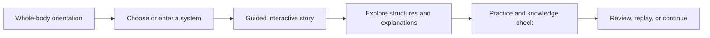

# AnatomIQ Project Vision

| Field | Value |
| --- | --- |
| Document ID | AQ-VIS-001 |
| Version | 0.1.0 |
| Status | Draft |
| Owner | AnatomIQ Project Team |
| Created | 2026-07-27 |
| Last updated | 2026-07-27 |
| Review cadence | Before MVP scope approval and each major product release |
| Related documents | [Project Constitution](../00-Constitution/PROJECT_CONSTITUTION.md), [Documentation Standards Manual](../00-Constitution/DOCUMENTATION_STANDARDS.md) |

## Purpose

This document defines AnatomIQ’s intended future and the strategic direction that guides product choices. It explains what AnatomIQ aims to become, whom it serves, the learning experience it should create, and the boundaries that keep the project focused.

It is deliberately technology-agnostic. Engineering choices must support this vision; they do not define it.

## Scope

### In scope

- Product identity and long-term aspiration.
- Intended learners and learning contexts.
- The core experience and product differentiation.
- Product boundaries and vision-level success signals.

### Out of scope

- Detailed feature requirements, implementation architecture, pricing, launch plans, or timeline commitments.
- A complete medical curriculum or clinical guidance.
- A claim that AnatomIQ replaces qualified teachers, textbooks, clinical training, or professional healthcare.

## Vision statement

**AnatomIQ enables learners to understand the human body by exploring living anatomical systems as clear, interactive stories rather than memorizing disconnected diagrams.**

The long-term product is an interactive human anatomy and physiology platform in which learners can move from whole-body orientation to focused system journeys, observe processes unfold over time, control the pace of exploration, and connect structure with function.

## The opportunity

Human anatomy is spatial, dynamic, and interconnected. Traditional learning materials often separate it into static illustrations, isolated labels, videos, and paragraphs. These formats are useful references, but they make it hard for learners to form an integrated mental model of where structures are, how they relate, and what changes over time.

AnatomIQ addresses this gap by combining:

- a navigable whole-body view;
- cinematic but learner-controlled visual storytelling;
- system-level journeys that make physiological flow visible;
- contextual explanations and annotations;
- opportunities to predict, replay, and check understanding.

The goal is not to make anatomy entertaining for its own sake. The goal is to make important relationships easier to see, explain, and remember.

## Product promise

For a learner, AnatomIQ should answer three questions at once:

1. **Where is it?** — spatial location and relationship to nearby structures.
2. **What does it do?** — function over time, including flow, signaling, movement, exchange, or regulation.
3. **Why does it matter?** — relevance to the wider system, common misconceptions, and carefully scoped clinical context.

AnatomIQ must not force learners to choose between an impressive visual and a clear explanation. The two must reinforce each other.

## Intended learners

The platform is designed progressively: it starts accessible to newcomers while retaining enough depth and precision to remain useful as a learner advances.

| Audience | Primary need | Expected use |
| --- | --- | --- |
| Secondary-school biology learners | Build a first coherent mental model of body systems | Guided exploration and curriculum reinforcement |
| Pre-medical and entrance-exam learners | Connect diagrams, terminology, and physiological sequence | Concept review, revision, and self-checks |
| Undergraduate health-science learners | Visualize structure-function relationships in greater detail | Supplement to lectures, labs, and textbooks |
| Educators | Demonstrate processes and anchor discussion in a shared visual model | Classroom projection, assigned exploration, or revision support |
| Curious lifelong learners | Explore reliable foundational anatomy without unnecessary jargon | Self-directed learning |

The MVP prioritizes learners who benefit from a clear cardiovascular-system story. The platform’s architecture and content model must remain extensible to the nervous, respiratory, digestive, endocrine, urinary, immune, and reproductive systems.

## Experience vision

The default experience begins with a complete but simplified human-body orientation. A learner chooses or enters a body system, then follows a guided, scroll-driven story that can be paused, replayed, navigated directly, and explored through annotations.

For example, a cardiovascular lesson may take the learner from the chambers of the heart to the lungs, through systemic circulation, and back to the heart. At each step, the experience reveals the relevant structure, direction of flow, function, and vocabulary. The learner can inspect the view, test a prediction, and revisit an earlier step without losing context.

The experience should feel focused, calm, precise, and cinematic—closer to a guided scientific exploration than a game, a slide deck, or a passive video.

## Product pillars

### 1. See relationships, not isolated parts

Structures are presented in context: an artery in relation to the heart and organs, a nerve in relation to the brain and spinal cord, or an alveolus in relation to surrounding capillaries. Anatomy is never reduced to a label list when a relationship can be shown.

### 2. Make processes visible over time

Physiology is taught through understandable sequences. Blood flow, gas exchange, neural signaling, digestion, filtration, and hormonal regulation should reveal direction, timing, cause, and result.

### 3. Keep the learner in control

Guidance directs attention but does not remove agency. Learners can pause, replay, slow down where supported, seek definitions, use non-motion alternatives, and return to a whole-body view.

### 4. Earn trust through precision and transparency

Medical content is sourced, reviewed appropriately, and clear about simplifications and limitations. The product avoids unsupported certainty and does not offer medical diagnosis or treatment advice.

### 5. Grow through a reusable lesson engine

Every new system should build on shared capabilities—narrative sequencing, camera control, annotations, interactions, assessments, and accessibility—while allowing the medical content to remain distinct and accurate.

## What makes AnatomIQ distinct

| Conventional reference experience | AnatomIQ experience |
| --- | --- |
| Static image with labels | Dynamic, contextual view with annotations available at the relevant moment |
| Separate chapters for structure and function | A single story connects structure, flow, and purpose |
| Passive video with fixed pacing | Guided visual sequence with learner controls and replay |
| Memorize terms before seeing relationships | See the relationship, then attach accurate terminology |
| Isolated organ model | Whole-body orientation and system-level connection |
| Visual novelty as the goal | Comprehension, accuracy, and retention as the goal |

The differentiation is not merely “3D anatomy.” It is an educational interaction model: learners travel through a medically grounded, learner-controlled story that makes systems and processes easier to reason about.

## Long-term destination

Over time, AnatomIQ can become a modular atlas of interconnected systems:

| System | Representative learning journey |
| --- | --- |
| Cardiovascular | Follow blood through the heart, lungs, systemic circulation, and return pathway |
| Nervous | Follow sensory and motor signaling between brain, spinal cord, peripheral nerves, and muscle |
| Respiratory | Follow air to the alveoli and observe gas exchange with the bloodstream |
| Digestive | Follow food through digestion, absorption, transport, and elimination |
| Endocrine | Trace hormonal signaling from a gland to target tissues and feedback regulation |
| Urinary | Follow blood filtration through the kidney and urine formation to the bladder |
| Immune | Explore a carefully scoped immune response from detection through recovery |
| Reproductive | Present age-appropriate, medically accurate lessons on anatomy, hormones, and development |

This does not imply that all systems will be built at once. The platform earns expansion by demonstrating learning value, scientific quality, maintainability, and technical viability in its MVP.

## Vision boundaries

To protect focus, AnatomIQ is not initially:

- a diagnostic tool, symptom checker, or source of individualized medical advice;
- a comprehensive clinical simulator or substitute for supervised practical training;
- a photorealistic body-model project without instructional objectives;
- a social network, advertising platform, or attention-maximizing game;
- an attempt to encode every structure, disease, or medical specialty in the first release;
- a product that assumes high-end hardware, precise mouse control, or unrestricted motion tolerance.

Potential future features—pathology comparisons, AI-assisted questioning, educator tools, more detailed models, and simulations—must be evaluated against the Project Constitution before becoming commitments.

## Vision-level success signals

The vision is progressing when evidence shows that learners can form clearer mental models, not merely spend more time on the platform.

Early signals include:

- learners can accurately describe the direction and purpose of a demonstrated process after using a lesson;
- learners can locate and relate major structures in the lesson without relying only on memorized labels;
- learners use replay, annotation, and knowledge-check features to resolve misunderstandings;
- educators can explain why the experience complements—not replaces—their existing materials;
- the team can add a new lesson using shared platform capabilities rather than recreating the experience from scratch;
- feedback identifies understandable, actionable improvements rather than recurring confusion caused by the visual model.

Specific metrics, research methods, and MVP targets will be defined in the Product Requirements and Success Criteria documents.

## Strategic decision filters

When scope is uncertain, prioritize work that:

1. makes a difficult spatial or temporal concept easier to understand;
2. strengthens the cardiovascular MVP as a proof of the reusable lesson model;
3. improves accessibility, reliability, and learner control;
4. produces validated reusable capabilities for later systems;
5. increases scientific traceability and content-review confidence.

Deprioritize work that is visually impressive but does not improve understanding, depends on unreviewed medical claims, creates one-off architecture, or delays the core learning journey.

## Open questions

- [ ] Which learner segment will be the primary validation group for the cardiovascular MVP?
- [ ] Which curriculum or examination frameworks should early lessons align with, if any?
- [ ] What level of anatomical fidelity is necessary for the MVP’s educational claims?
- [ ] What medical-review process is feasible before the first public demonstration?

## Revision history

| Version | Date | Author/owner | Summary |
| --- | --- | --- | --- |
| 0.1.0 | 2026-07-27 | AnatomIQ Project Team | Initial project vision draft. |

## Review checklist

- [x] Metadata, purpose, scope, and exclusions are complete.
- [x] Vision statement, intended learners, experience vision, product pillars, and boundaries are defined.
- [x] The MVP emphasis is clear without overcommitting to an implementation.
- [x] Medical and educational limitations are explicit.
- [x] Open questions are identified for later product validation.
- [x] AI Context is complete.

## AI Context

| Item | Value |
| --- | --- |
| Objective | Use this vision to evaluate whether a proposed AnatomIQ feature, lesson, design, or architecture decision advances the intended learning experience. |
| Constraints | Preserve scientific integrity, learner control, accessibility, privacy, and the reusable lesson-engine direction from `AQ-CON-001`. |
| Inputs | This document, the Project Constitution, and the relevant approved product, design, engineering, or medical specification. |
| Outputs | A focused proposal or implementation that connects to a learning objective and clearly states its contribution to the cardiovascular MVP or reusable platform. |
| Do not assume | That all body systems, pathology modes, AI features, curriculum alignment, or medical reviews are already in scope or approved. |
| Validation | Confirm the work improves understanding of a spatial or temporal relationship, respects stated boundaries, can be accessed with learner control, and does not make unsupported medical claims. |
