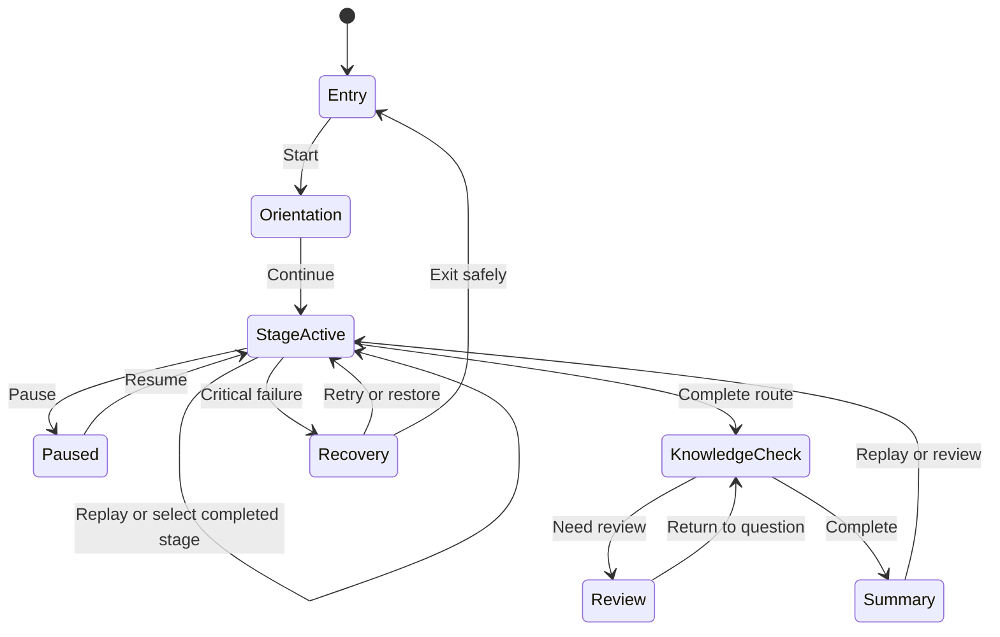

# AnatomIQ Functional Requirements

| Field | Value |
| --- | --- |
| Document ID | AQ-PRD-005 |
| Version | 0.1.0 |
| Status | Draft |
| Owner | AnatomIQ Project Team |
| Created | 2026-07-27 |
| Last updated | 2026-07-27 |
| Review cadence | Before engineering implementation and whenever an MVP behavior changes |
| Related documents | [Product Requirements Document](PRODUCT_REQUIREMENTS_DOCUMENT.md), [MVP Scope](MVP_SCOPE.md), [User Journeys](USER_JOURNEYS.md) |

## Purpose

This document expands the MVP’s functional behavior into testable requirements. It is the product-level contract for what learners and educators can do; later UX and engineering documents may define how these behaviors are presented and implemented.

## Functional requirements

| ID | Requirement | Priority | Acceptance criteria |
| --- | --- | --- | --- |
| F-001 | The lesson must present a title, learner-level indication, objective, and educational scope before main progression. | Must | All four items are available before the learner enters the guided route. |
| F-002 | The lesson must establish spatial context for the heart and lungs. | Must | The learner can access an orientation view or equivalent description before focused flow stages. |
| F-003 | The lesson must represent the approved major route in the correct taught order. | Must | Each major route segment occurs in sequence and is supported by appropriate labels/cues. |
| F-004 | The lesson must distinguish pulmonary and systemic circulation. | Must | The route and explanations make their broad purposes distinguishable. |
| F-005 | The lesson must communicate flow direction and oxygenation-state meaning using more than colour. | Must | Grayscale/reduced-colour review retains required meaning. |
| F-006 | The lesson must display only the primary information needed at each main stage by default. | Must | Optional detail does not obscure the active stage’s core takeaway. |
| F-007 | Learners must be able to pause active time-based content. | Must | Visual motion, camera movement, and synchronized lesson media stop and resume at the same state. |
| F-008 | Learners must be able to replay the current stage and restart the complete lesson. | Must | Replay/reset produces a valid, predictable state. |
| F-009 | Learners must be able to identify current progress and revisit completed major stages. | Must | Current stage is clear; selected completed stage restores correct context. |
| F-010 | Required annotations must expose name and concise function/relevance. | Must | Every structure needed for outcomes has accessible annotation content. |
| F-011 | Required annotations must be accessible without hover-only input. | Must | Keyboard or equivalent interaction opens and dismisses required annotation content. |
| F-012 | The lesson must include formative checks aligned to `LO-CV-01`–`LO-CV-05`. | Must | Each question references one or more outcome IDs in its specification. |
| F-013 | Feedback must explain reasoning and offer a review route. | Must | Correct and incorrect states contain useful explanation; review does not lose question context. |
| F-014 | Core journey controls must be keyboard-operable. | Must | Start, progress, pause, replay, stage navigation, annotation access, and knowledge checks work without a pointer. |
| F-015 | The product must offer a reduced-motion or step-based essential path. | Must | A learner can complete all core objectives without forced continuous movement. |
| F-016 | The product must preserve coherent lesson state across pause, replay, review, preference change, and recoverable error. | Must | No action results in misleading route order or silent loss of critical context. |
| F-017 | A critical asset or rendering failure must provide a plain-language recovery path. | Must | Learner can retry, use an alternative when available, return safely, or exit. |
| F-018 | The summary must recap the taught route and provide replay/review/exit actions. | Must | Summary is reachable after the lesson and does not imply certification. |
| F-019 | The product should support educator-led pause, replay, and major-stage review without account setup. | Should | Controls are usable on a shared display in the documented reference context. |
| F-020 | The product should retain relevant in-session learner preferences. | Should | Reduced-motion and similar session settings behave predictably and are communicated on reset. |

## Business rules

- BR-01: The product is educational; no lesson, annotation, feedback message, or summary may imply diagnosis, treatment, or individualized medical advice.
- BR-02: The default route must follow the approved medical-content specification. Any alternative visualization or simplification must be labelled and reviewed.
- BR-03: Optional content may add context but must not be required to complete a Must learning outcome.
- BR-04: A completed knowledge check is formative feedback, not proof of competence.
- BR-05: Feature behavior that affects a core requirement must be documented before implementation and tested against the applicable journey.

## State transitions

## Traceability

| Functional area | Primary user journey | Learning outcomes |
| --- | --- | --- |
| Orientation and route | Journey 1, Journey 4 | LO-CV-01 to LO-CV-05 |
| Playback and review | Journey 1, Journey 2, Journey 3, Journey 4 | LO-CV-02 to LO-CV-05 |
| Annotations | Journey 1, Journey 2, Journey 4 | LO-CV-01 to LO-CV-05 as applicable |
| Knowledge checks | Journey 1, Journey 2, Journey 4 | LO-CV-01 to LO-CV-05 |
| Recovery | Journey 5 | Preserves access to applicable outcomes |

## Open questions

- [ ] How many major route stages are necessary for comprehension without over-fragmenting the story?
- [ ] Which annotation details are required by default versus optional deeper context?
- [ ] What exact behavior defines “replay current stage” when the learner has opened optional details?

## Revision history

| Version | Date | Author/owner | Summary |
| --- | --- | --- |
| 0.1.0 | 2026-07-27 | AnatomIQ Project Team | Initial detailed MVP functional requirements. |

## Review checklist

- [x] Functional behavior is testable and mapped to priority.
- [x] State, business, and accessibility behavior are included.
- [x] Requirements trace to user journeys and learning outcomes.
- [x] AI Context is complete.

## AI Context

| Item | Value |
| --- | --- |
| Objective | Implement and test the declared learner and educator behaviors without changing product scope or medical content. |
| Constraints | Treat all Must requirements and business rules as mandatory; preserve coherent state; do not replace accessibility paths with optional polish. |
| Inputs | This document, MVP Scope, User Journeys, and approved future UX/engineering/medical specifications. |
| Outputs | A task, component behavior, state transition, test case, or acceptance report mapped to an F-ID. |
| Do not assume | Layout, animation technique, 3D library, question format, or medical detail not specified in approved documents. |
| Validation | Test the relevant acceptance criteria and user journey, including keyboard/reduced-motion behavior where applicable. |
