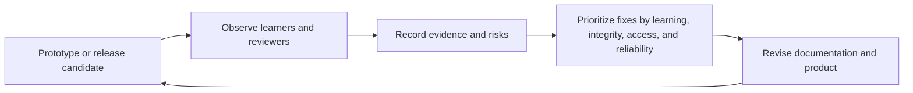

# AnatomIQ Release and Validation Plan

| Field | Value |
| --- | --- |
| Document ID | AQ-PRD-008 |
| Version | 0.1.0 |
| Status | Draft |
| Owner | AnatomIQ Project Team |
| Created | 2026-07-27 |
| Last updated | 2026-07-27 |
| Review cadence | At each validation cycle and before internal, demo, or public release |
| Related documents | [Success Criteria](../01-Vision/SUCCESS_CRITERIA.md), [MVP Scope](MVP_SCOPE.md), [User Journeys](USER_JOURNEYS.md), [Non-Functional Requirements](NON_FUNCTIONAL_REQUIREMENTS.md) |

## Purpose

This document defines how AnatomIQ progresses from a documented MVP to a validated release candidate. It prioritizes evidence of learner understanding, scientific integrity, accessibility, and reliable experience over feature count.

## Release stages

| Stage | Purpose | Required output | Exit evidence |
| --- | --- | --- | --- |
| R0 — Documentation ready | Establish a reviewable product definition. | Approved or accepted Draft PRD set, lesson objective set, scope, and risks. | No material scope ambiguity blocks prototype work. |
| R1 — Internal orientation prototype | Test body context and basic navigation. | Simplified orientation experience. | Users can locate heart/lungs and identify the lesson objective. |
| R2 — Guided route prototype | Test circulation story clarity. | Major route sequence with minimal controls. | Representative learners can broadly trace route; confusion is recorded. |
| R3 — Interactive MVP candidate | Test playback, annotations, practice, and accessible routes. | End-to-end lesson candidate. | Core user journeys work; critical usability and content issues are addressed. |
| R4 — Release candidate | Verify quality gates. | Stable, reviewed MVP build and evidence pack. | All applicable release gates pass or approved exceptions exist. |
| R5 — Public demonstration / MVP release | Share the scoped product honestly. | Release notes, known limitations, support statement, feedback path. | Release owner approves based on documented evidence. |

## Validation questions

| ID | Question | Primary evidence | Decision informed |
| --- | --- | --- | --- |
| VQ-01 | Can a primary learner describe the major circulation route after the lesson? | Objective-aligned post-task and think-aloud. | Story clarity and learning value. |
| VQ-02 | Can learners distinguish pulmonary and systemic circulation at the taught level? | Explanation or ordering task. | Content and feedback adequacy. |
| VQ-03 | Can learners find and use pause, replay, review, and annotations? | Moderated task completion. | Control discoverability and learner agency. |
| VQ-04 | Can keyboard/reduced-motion learners complete essential outcomes? | Alternative-path task testing. | Accessibility release gate. |
| VQ-05 | Can an educator facilitate the main sequence? | Shared-display walkthrough. | Educator support priority. |
| VQ-06 | Does the experience remain stable on the reference environment? | Performance and recovery tests. | Technical readiness. |
| VQ-07 | Are the route, labels, and simplifications medically responsible? | Source check and qualified review. | Content readiness. |

## Minimum validation activities

### Learner usability and comprehension sessions

Use a small number of representative, consented participants where practical. Ask them to perform the user-journey tasks and explain their understanding in their own words. Record observations only under the approved privacy plan.

Minimum tasks:

1. State the lesson objective and locate heart/lungs.
2. Trace blood from body to lungs and from lungs to body.
3. Pause and replay the pulmonary route.
4. Access an annotation and explain its purpose.
5. Answer a knowledge-check question, then use feedback to review a step.

### Accessibility checks

Perform keyboard-only and reduced-motion checks on every release candidate. Test colour independence and text alternatives. Seek direct feedback from relevant users or accessibility reviewers where feasible; do not treat self-testing as complete validation.

### Medical-content review

Before public release, obtain the defined review for route accuracy, labels, learner-facing claims, and disclosed simplifications. Record the reviewer role, date, scope, feedback, and resolution.

### Technical checks

Test the documented support matrix, critical user journeys, error recovery, loading behavior, and performance budgets. Record known limitations honestly.

## Evidence pack

Each release candidate must have:

- [ ] Version identifier and change summary.
- [ ] Requirement traceability and Must-requirement status.
- [ ] Learner-validation findings and changes made.
- [ ] Accessibility test results and unresolved limitations.
- [ ] Medical-content source/review record.
- [ ] Performance/support-matrix results.
- [ ] Error-recovery results.
- [ ] Risk-register update.
- [ ] Release decision: ready, not ready, or ready with documented exceptions.

## Release decision rules

The release owner must mark a candidate **not ready** when a Must requirement, scientific-integrity issue, accessibility blocker, unrecoverable critical journey defect, or unknown high-severity risk remains unresolved.

An exception may be accepted only through the Constitution’s exception process. The release notes must state the limitation in learner-appropriate terms when it affects user experience or support.

## Feedback and iteration loop

## Open questions

- [ ] What consent and privacy process will be used for learner sessions?
- [ ] How many learner sessions are feasible before the first public demo?
- [ ] Who is the release owner and medical-content reviewer for the MVP?
- [ ] What feedback channel will be offered after public demonstration?

## Revision history

| Version | Date | Author/owner | Summary |
| --- | --- | --- | --- |
| 0.1.0 | 2026-07-27 | AnatomIQ Project Team | Initial staged release and validation plan. |

## Review checklist

- [x] Release stages, validation questions, activities, evidence, and decision rules are defined.
- [x] Learner, accessibility, medical, and technical validation are included.
- [x] No unsubstantiated effectiveness targets are claimed.
- [x] AI Context is complete.

## AI Context

| Item | Value |
| --- | --- |
| Objective | Plan or evaluate a release based on evidence that the MVP works for learners, is medically responsible, accessible, and technically reliable. |
| Constraints | Do not mark a release ready without applicable evidence; do not invent research results, review approval, test outcomes, or exceptions. |
| Inputs | This plan, Success Criteria, requirements, user journeys, medical review record, test results, and risk register. |
| Outputs | A validation plan, session guide, evidence summary, release checklist, or readiness decision. |
| Do not assume | Completion of implementation proves learner value or release readiness. |
| Validation | Assemble the evidence pack, assess release rules, and document gaps, risks, and decisions. |
