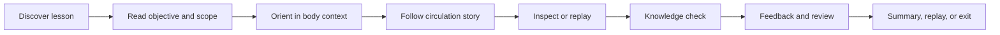

# AnatomIQ User Journeys

| Field | Value |
| --- | --- |
| Document ID | AQ-PRD-003 |
| Version | 0.1.0 |
| Status | Draft |
| Owner | AnatomIQ Project Team |
| Created | 2026-07-27 |
| Last updated | 2026-07-27 |
| Review cadence | Before UX specification approval, prototype testing, and MVP release |
| Related documents | [Product Requirements Document](PRODUCT_REQUIREMENTS_DOCUMENT.md), [User Personas](USER_PERSONAS.md), [Product Philosophy](../01-Vision/PRODUCT_PHILOSOPHY.md), [Educational Philosophy](../01-Vision/EDUCATIONAL_PHILOSOPHY.md), [Success Criteria](../01-Vision/SUCCESS_CRITERIA.md) |

## Purpose

This document describes how representative people move through the AnatomIQ cardiovascular MVP to achieve a learning or teaching goal. It turns requirements into observable experience flows, including normal use, accessibility alternatives, and recoverable failure states.

User journeys are product behavior specifications. They do not prescribe final page layouts, animations, component names, or technical implementation.

## Scope

### In scope

- First-time learner journey through the complete cardiovascular lesson.
- Learner review and knowledge-check journey.
- Educator-led facilitation journey.
- Keyboard and reduced-motion journey for essential learning outcomes.
- Asset-load or interaction-recovery journey.

### Out of scope

- Account, payment, social, or multi-lesson progression journeys.
- Clinical, diagnostic, or patient-care workflows.
- Detailed UI wireframes and visual style specifications.
- Future body-system journeys beyond reusable patterns established by the MVP.

## Journey principles

Every journey must uphold the following:

1. The learner knows where they are, what they are learning, and what to do next.
2. The primary story remains comprehensible even when optional details are not explored.
3. Learners can pause, replay, revisit, and recover without losing essential context.
4. Essential learning value is not dependent on pointer-only interaction, colour-only meaning, or continuous motion.
5. Knowledge checks help learners correct their model rather than merely score completion.
6. Failures are explained in plain language and provide a useful recovery path.

## Journey map overview

## Journey 1 — First-time learner completes the cardiovascular story

| Field | Value |
| --- | --- |
| Persona | Aarav — foundational anatomy learner |
| Trigger | The learner wants to understand blood circulation for class, revision, or personal study. |
| Primary job | Build an accurate, high-level mental model of the route and purpose of blood flow. |
| Success outcome | The learner can trace the major taught route, explain pulmonary versus systemic circulation in simple terms, and knows where to revisit confusing content. |
| Requirements supported | FR-01 through FR-06; FR-07 where applicable; LO-CV-01 through LO-CV-05 |

### Flow

| Step | Learner action or thought | Product response | Learning/experience outcome |
| --- | --- | --- | --- |
| 1 | Opens the cardiovascular lesson. “What will this teach me?” | Displays lesson title, learner level, objective, educational scope, and a concise control hint. | Learner understands the lesson’s purpose and non-clinical boundary. |
| 2 | Chooses Start. | Establishes whole-body or thoracic context with heart and lungs visible. | Learner gains orientation before details appear. |
| 3 | Notices the active system. “Where am I?” | Identifies the cardiovascular system and relates the heart and lungs to the wider body. | Learner has a spatial frame for the route. |
| 4 | Continues into the first flow stage. | Focuses on blood returning from the body to the right side of the heart; exposes only essential labels and direction cues. | Learner observes one meaningful event rather than a dense diagram. |
| 5 | Pauses to inspect a label or explanation. | Freezes time-based motion and preserves the current camera/lesson state; required annotation content is accessible. | Learner controls pace and connects a structure name to its function. |
| 6 | Continues through the lungs. | Shows the pulmonary route and explains the high-level oxygenation change using more than colour alone. | Learner understands why the route includes the lungs. |
| 7 | Continues through the left side of the heart and to the body. | Shows the systemic route with directional cues, relevant terminology, and clear sequence boundaries. | Learner can distinguish the two broad circuits. |
| 8 | Revisits an earlier step after confusion. | Displays a predictable step navigator or replay path and restores the selected step safely. | Learner resolves confusion without restarting the whole lesson. |
| 9 | Starts a knowledge check. | Presents low-stakes, objective-aligned questions. | Learner tests the mental model created by the story. |
| 10 | Answers incorrectly. | Gives reasoning-based feedback and a direct route to the relevant review point. | Learner sees what to correct and how to correct it. |
| 11 | Replays the needed section and retries or continues. | Preserves clear state and offers a predictable return to practice. | Learner performs an active correction rather than guessing. |
| 12 | Reaches the summary. | Recaps the taught route, lists core takeaways, and offers replay, step review, or exit. | Learner leaves with a concise consolidating model and agency over next steps. |

### Critical moments

| Moment | Required product behavior | Failure to avoid |
| --- | --- | --- |
| First entry | Objective and scope are visible before complex visuals demand attention. | Immediate animation with no orientation or explanation. |
| First flow step | Direction, structure, and purpose are clear without every label appearing at once. | A visually busy scene that forces memorization before understanding. |
| Pause and annotation | Pausing stops synchronized movement without resetting or desynchronizing the lesson. | “Pause” freezes only one element while narration or camera continues. |
| Oxygenation explanation | Meaning is communicated with text and visual cues beyond red/blue colour. | Teaching that arteries are defined by colour or oxygenation state. |
| Incorrect answer | Feedback is specific and provides a revisitable explanation. | Generic error feedback or forced restart. |

### Journey acceptance criteria

- [ ] A first-time learner can state the learning objective before the main flow begins.
- [ ] The learner can complete the primary route without being forced to interact with optional details.
- [ ] The learner can pause, replay, and return to a previous major step.
- [ ] Required explanations remain available during or after a time-based sequence.
- [ ] The learner receives explanatory feedback after an incorrect knowledge-check answer.
- [ ] The final summary does not imply clinical or academic certification.

## Journey 2 — Learner revisits a difficult concept

| Field | Value |
| --- | --- |
| Persona | Aarav or Maya |
| Trigger | The learner remembers a confusing point, such as why blood goes from the heart to the lungs before returning to the heart. |
| Primary job | Find, inspect, and understand one segment without repeating unnecessary content. |
| Success outcome | The learner reaches the correct stage, accesses the relevant explanation, and returns to the lesson or knowledge check with context preserved. |
| Requirements supported | FR-04, FR-05, FR-06; LO-CV-02 through LO-CV-05 |

### Flow

1. The learner opens the lesson or summary and selects a major route segment, a replay control, or a review link from feedback.
2. The product identifies the selected stage and communicates its place in the overall route.
3. The learner reviews the visual sequence at a controllable pace and opens the relevant annotation or explanation.
4. The learner returns to the related knowledge-check question or continues to the next stage.
5. The product preserves enough context that the learner understands how the reviewed segment connects to what comes before and after.

### Acceptance criteria

- [ ] A review action reaches the relevant stage in no more than a reasonable number of clearly labelled actions; the exact target will be set during usability testing.
- [ ] The reviewed stage identifies its position in the larger circulation story.
- [ ] The learner can move from feedback to review and back without losing the question context.
- [ ] Direct navigation cannot put the lesson into an invalid or misleading state.

## Journey 3 — Educator facilitates a group lesson

| Field | Value |
| --- | --- |
| Persona | Priya — educator and facilitator |
| Trigger | The educator wants to introduce or reinforce circulation for a class or small study group. |
| Primary job | Use a shared visual model while maintaining control of pace and discussion. |
| Success outcome | The educator can orient the group, pause and replay key steps, and use knowledge checks as discussion prompts. |
| Requirements supported | FR-01, FR-03, FR-04, FR-05, FR-06, FR-08 |

### Flow

| Step | Educator action | Product response | Group outcome |
| --- | --- | --- |
| 1 | Opens the lesson on a shared display. | Shows title, objective, scope, and controls without requiring individual accounts. | Group knows the topic and intended outcome. |
| 2 | Starts the whole-body orientation. | Provides readable system context and clear focus. | Learners share a spatial frame. |
| 3 | Pauses at the right-heart or lung stage to explain a question. | Freezes and preserves the scene; annotations remain readable and available. | Educator can connect visual and verbal explanation. |
| 4 | Replays the flow stage. | Restarts the selected sequence predictably. | Group can watch the relationship again. |
| 5 | Uses a knowledge-check prompt for discussion. | Shows a clear question and reasoning-based feedback after a response. | Learners articulate and correct their model together. |
| 6 | Returns to an earlier step after a question. | Uses visible step navigation and maintains coherent route context. | Discussion is supported without technical disruption. |

### Acceptance criteria

- [ ] The educator can begin the core journey without account creation or a setup flow that delays teaching.
- [ ] Pause, replay, reset, and major-step navigation are discoverable from the shared display.
- [ ] Primary labels and controls remain readable at the defined shared-display baseline.
- [ ] The product continues to communicate scope and simplifications when used in a group context.

## Journey 4 — Keyboard and reduced-motion learner completes the lesson

| Field | Value |
| --- | --- |
| Persona | Sam — learner using accessibility alternatives |
| Trigger | The learner has a keyboard-only workflow, reduced-motion preference, cannot rely on colour, or requires essential text alternatives. |
| Primary job | Complete the same cardiovascular learning objectives through supported controls and representations. |
| Success outcome | The learner can orient, navigate, access explanations, understand flow direction, answer questions, and review content without forced continuous motion or pointer-only interaction. |
| Requirements supported | FR-01, FR-03 through FR-07; NFR-03 |

### Flow

| Step | Learner action | Product response | Required equivalence |
| --- | --- | --- |
| 1 | Enters the lesson using keyboard or selects a reduced-motion preference. | Focus order is visible and logical; the setting is applied or its state is clearly communicated. | Learner can start without pointer use. |
| 2 | Reads the objective and scope. | Text content is keyboard reachable and does not disappear before it can be read. | Same entry understanding as the default path. |
| 3 | Starts orientation. | Provides a step-based or reduced-motion representation and text description of essential body context. | Learner understands the location of heart and lungs. |
| 4 | Moves through a circulation step. | Direction is communicated by text, order, arrows, labels, patterns, or position—not colour alone. | Learner can identify the route and state change. |
| 5 | Opens an annotation. | Required information is available through focusable controls, not hover alone. | Learner accesses the same core structure and function explanation. |
| 6 | Pauses, replays, or changes steps. | Controls are keyboard-operable, visibly focused, and preserve state. | Learner controls pace and review. |
| 7 | Completes a knowledge check. | Question controls and feedback are fully operable and announced or otherwise exposed appropriately. | Learner can practice and receive reasoning-based feedback. |
| 8 | Reaches summary or exits. | The route summary and replay options remain available in a non-motion-dependent form. | Learner completes the same intended outcome. |

### Acceptance criteria

- [ ] All essential lesson controls are reachable and usable by keyboard alone.
- [ ] Focus is always visible and proceeds in a logical order.
- [ ] The reduced-motion path provides the major circulation story without continuous forced camera movement.
- [ ] Essential information is not presented only through colour, hover, or audio.
- [ ] Required text alternatives meaningfully describe the concept, not only the visual asset.
- [ ] The knowledge check and explanatory feedback are fully usable through the alternative path.

## Journey 5 — Learner recovers from a loading or interaction failure

| Field | Value |
| --- | --- |
| Persona | Any learner |
| Trigger | A 3D asset, lesson scene, connection, control, or rendering capability fails during the experience. |
| Primary job | Understand what happened and continue, retry, or exit without misleading progress or lost context. |
| Success outcome | The learner receives a plain-language message, an appropriate recovery action, and a path that preserves essential learning value where possible. |
| Requirements supported | FR-04, FR-08; NFR-01, NFR-02, NFR-09 |

### Flow

1. The product detects that a required view, asset, or action cannot complete safely.
2. It stops or prevents the broken interaction rather than showing a misleading partial state.
3. It explains the problem in plain language without exposing technical jargon as the only information.
4. It offers a contextual recovery action: retry, return to the last stable lesson step, use a simplified alternative, or exit to the lesson overview.
5. If a prior stable state exists, the product preserves lesson progress or clearly explains what will reset.
6. The learner chooses a recovery path and can continue without being trapped.

### Acceptance criteria

- [ ] An error message identifies the affected learning action in understandable language.
- [ ] At least one recovery action is provided whenever technically possible.
- [ ] A recoverable failure does not silently reset lesson progress.
- [ ] A fallback or alternate explanation is offered when the primary 3D view cannot support the essential concept.
- [ ] The learner can safely leave the failed state using keyboard as well as pointer input.

## Cross-journey state model

The product must preserve a coherent learner state across journeys. The following conceptual state is required; its implementation belongs to engineering documentation.

| State element | Meaning | Must persist during |
| --- | --- | --- |
| Active lesson | The selected body-system lesson. | Navigation within the lesson and recoverable errors. |
| Current major step | The learner’s position in the circulation story. | Pause, replay, direct review, and accessible alternatives. |
| Playback state | Playing, paused, replaying, or reduced-motion/step-based. | Control changes and revisits. |
| Annotation context | The structure or explanation currently opened. | Pause and non-destructive navigation where practical. |
| Knowledge-check context | Question, response state, feedback, and review link. | Review trip and return. |
| Learner preference | Relevant in-session setting such as reduced motion. | Entire lesson session unless clearly stated otherwise. |

## Journey-level usability test tasks

These tasks should be tested with representative learners and educators when a prototype exists.

| Task ID | Prompt | Expected evidence |
| --- | --- | --- |
| UT-01 | “Show me where blood goes after it returns from the body.” | Learner enters or finds the right-heart stage and explains the taught next step. |
| UT-02 | “Pause at the point where blood travels to the lungs, then show it again.” | Learner finds pause and replay without facilitator intervention. |
| UT-03 | “What does this structure do in the route?” | Learner accesses a relevant annotation and states its function. |
| UT-04 | “You chose the wrong answer—show me where you would review it.” | Learner follows feedback to the correct lesson step. |
| UT-05 | “Complete the lesson without using a mouse and with reduced motion.” | Learner completes core tasks and describes the route. |
| UT-06 | “Teach this step to a group, then go back one stage.” | Educator controls the view, pauses, explains, and revisits. |

## Open questions

- [ ] Should the learner choose between guided and free exploration at entry, or should free exploration follow the guided story in the MVP?
- [ ] What exact navigation pattern best supports direct step review without encouraging learners to skip essential orientation?
- [ ] What is the MVP fallback when a learner’s device cannot render the primary 3D scene?
- [ ] Should educator-specific controls appear in the base interface or be deferred until validation shows the need?

## Revision history

| Version | Date | Author/owner | Summary |
| --- | --- | --- | --- |
| 0.1.0 | 2026-07-27 | AnatomIQ Project Team | Initial MVP user journeys, accessible path, and recovery flow. |

## Review checklist

- [x] Primary learner, review, educator, accessible, and recovery journeys are documented.
- [x] Each journey connects a user action to product behavior and intended learning outcome.
- [x] Journey acceptance criteria and usability-test tasks are included.
- [x] Accessibility is represented as an equivalent core journey, not an edge case.
- [x] State requirements and unresolved decisions are identified.
- [x] AI Context is complete.

## AI Context

| Item | Value |
| --- | --- |
| Objective | Design, implement, or test the cardiovascular MVP so each documented persona can complete an understandable, controllable, and recoverable learning journey. |
| Constraints | Preserve orientation, learner agency, equivalent essential access, contextual explanation, formative feedback, state coherence, and non-clinical scope. Do not add a journey step that requires an account, pointer-only interaction, forced motion, or undocumented content. |
| Inputs | This document, the master PRD, User Personas, Product Philosophy, Educational Philosophy, and future UX/accessibility specifications. |
| Outputs | A flow, component behavior, test case, state requirement, error recovery behavior, or acceptance check mapped to a named journey and requirement. |
| Do not assume | That learners know 3D controls, that default scrolling is accessible, that a completed route means understanding, or that a visual fallback preserves learning without testing. |
| Validation | Walk through each applicable journey, complete its acceptance criteria, test the corresponding usability task, and record any unresolved friction, exclusion, or state loss. |
