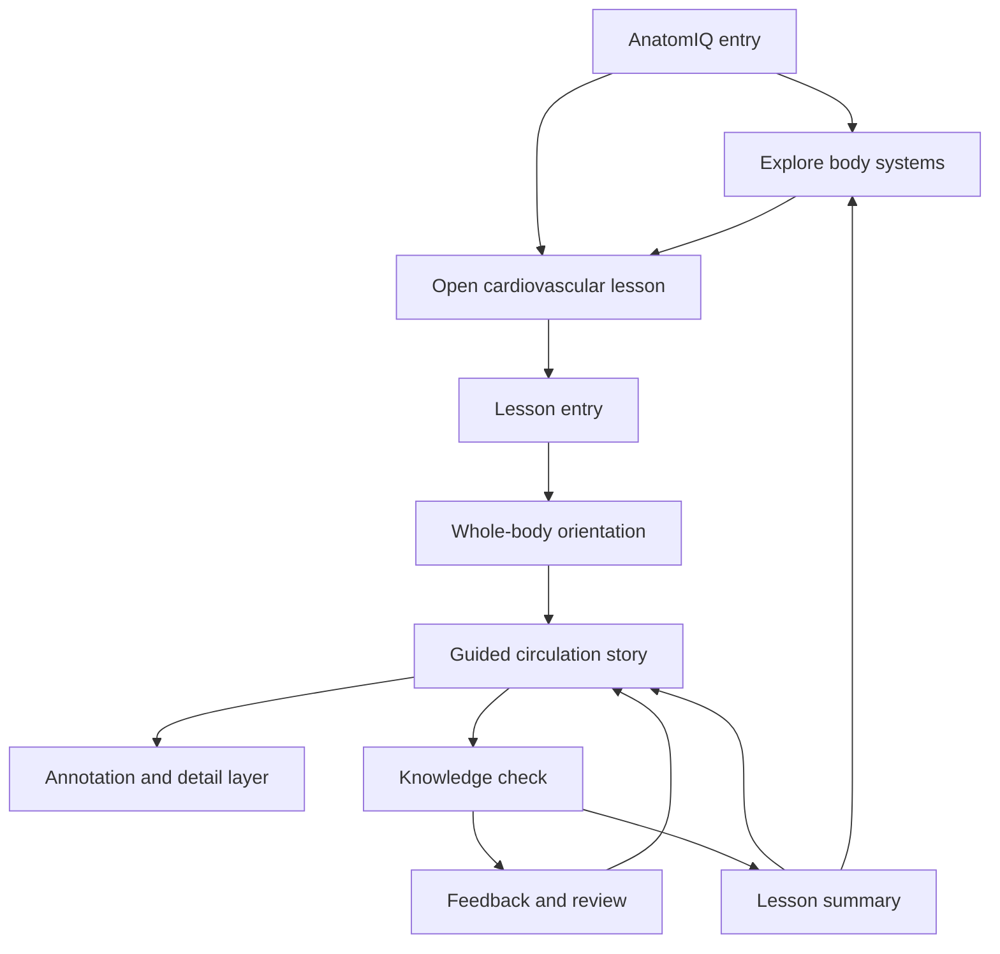

# AnatomIQ Information Architecture

| Field | Value |
| --- | --- |
| Document ID | AQ-UX-001 |
| Version | 0.1.0 |
| Status | Draft |
| Owner | AnatomIQ Project Team |
| Created | 2026-07-27 |
| Last updated | 2026-07-27 |
| Review cadence | Before wireframes, implementation, and each major content expansion |
| Related documents | [Product Requirements Document](../03-PRD/PRODUCT_REQUIREMENTS_DOCUMENT.md), [MVP Scope](../03-PRD/MVP_SCOPE.md), [User Journeys](../03-PRD/USER_JOURNEYS.md), [Product Philosophy](../01-Vision/PRODUCT_PHILOSOPHY.md) |

## Purpose

This document defines the structure of AnatomIQ: the major learner-facing areas, their hierarchy, and the information each area must provide. It ensures the cardiovascular MVP feels like one coherent learning experience rather than a collection of visual scenes.

## Core access rule

AnatomIQ is free to enter and use. The core learning experience must not require sign-up, login, payment, a profile, or personal data. Account-based progress, personalization, classrooms, and billing are explicitly out of scope unless later product evidence and an approved decision change this rule.

## Product map

## Major areas

| Area | Purpose | MVP status | Required information |
| --- | --- | --- | --- |
| Entry | Explain AnatomIQ and provide immediate access to learning. | Must | Product purpose, free/no-account access, available lesson(s), accessibility/help entry. |
| System explorer | Let learners select a body system and understand what is available. | Must, minimal | Cardiovascular availability; other systems clearly labelled as planned rather than interactive. |
| Lesson entry | Set expectation before visual storytelling begins. | Must | Lesson title, level, objective, scope, controls, reduced-motion/help access. |
| Whole-body orientation | Establish location and active system. | Must | Heart/lungs/body context, system name, start/continue action, progress context. |
| Guided story | Teach the major route through focused stages. | Must | Current stage, visual focus, concise explanation, playback controls, step navigation. |
| Annotation layer | Provide structure-specific context without interrupting the story. | Must | Name, role, relevance, optional detail, accessible open/close action. |
| Knowledge check | Help learners verify the taught model. | Must | Objective-aligned question, response control, feedback, review link. |
| Summary | Consolidate the route and provide next choices. | Must | Key takeaways, replay/review, system explorer/exit action, formative scope reminder. |
| Help and preferences | Make controls and access paths discoverable. | Must | Control guide, reduced-motion state, scope/limitation information, recovery support. |

## Hierarchy and content rules

### Entry

Entry must answer, within the first view: what AnatomIQ is, what a learner can explore now, and that no account is needed. The cardiovascular lesson is the primary call to action. Future systems may be listed only if clearly marked “planned” or equivalent; they must not appear actionable when unavailable.

### System explorer

The system explorer is a lightweight orientation and selection layer, not a complete catalogue. It must communicate the platform’s whole-body direction while keeping focus on the available cardiovascular MVP.

### Lesson

The lesson is the primary content container. It has three stable layers:

1. **Story layer** — the active route stage and its main explanation.
2. **Control layer** — progress, pause, replay, previous/next completed stage, reset, and help.
3. **Detail layer** — annotations, definitions, simplifications, and optional depth.

The detail layer must never hide the active story or make primary controls unreachable.

### Knowledge check and summary

Practice belongs within the lesson, not behind a separate account or course dashboard. Feedback must link to the correct story stage. Summary concludes the current learning loop and provides routes to replay, revisit, explore the body systems, or exit.

## Content hierarchy within a lesson stage

At any one time, content is prioritized in this order:

1. Current learning objective or stage takeaway.
2. Main visible structure/process and flow direction.
3. Primary stage explanation.
4. Controls needed to pause, replay, or move safely.
5. Optional annotations and deeper explanation.
6. Secondary metadata, sources, or help.

## Findability rules

- A learner must reach the available cardiovascular lesson from entry in one intentional action.
- Current lesson stage and current system must remain identifiable at all times.
- Pause, replay, help, and exit must be available from every guided-story stage.
- A learner must reach required annotation content without needing a mouse hover.
- A learner must move from incorrect-answer feedback to the relevant review point directly.
- No essential information is hidden behind account creation, a paywall, or an unavailable future-system card.

## Information ownership

| Information | Primary location | Secondary access |
| --- | --- | --- |
| Product purpose | Entry | Help/about area |
| Lesson objective and scope | Lesson entry | Help/summary |
| Current route meaning | Guided-story stage | Summary/review |
| Structure function | Annotation layer | Stage explanation |
| Simplification/limitation | Relevant stage/annotation | Help/summary |
| Controls | Control layer | Help overlay |
| Accessibility settings | Lesson entry/control layer | Help/preferences |
| Knowledge feedback | Knowledge check | Linked review stage |

## Expansion rules

Future systems add a system card and a lesson package; they should not require a new top-level navigation pattern. Account or personalization features, if ever considered, must remain optional and must not move essential learning behind authentication.

## Open questions

- [ ] Should the system explorer appear before entry or as the entry’s primary content?
- [ ] Should help/preferences be a persistent control, a compact overlay, or both?
- [ ] What is the clearest future-system label that informs without creating false expectation?

## Revision history

| Version | Date | Author/owner | Summary |
| --- | --- | --- | --- |
| 0.1.0 | 2026-07-27 | AnatomIQ Project Team | Initial MVP information architecture. |

## Review checklist

- [x] Major product areas and hierarchy are defined.
- [x] No-auth/free access is an explicit architectural rule.
- [x] Lesson layers, content hierarchy, and findability rules are included.
- [x] Expansion does not require a new navigation model.
- [x] AI Context is complete.

## AI Context

| Item | Value |
| --- | --- |
| Objective | Structure AnatomIQ so learners can immediately enter a clear cardiovascular lesson, control it, access explanations, practice, and exit without authentication. |
| Constraints | Do not add required accounts, paywalls, profiles, dashboards, or navigation that hides core learning. Keep story, controls, and optional detail distinct. |
| Inputs | This document, User Journeys, MVP Scope, and future visual/engineering specifications. |
| Outputs | A sitemap, route map, screen structure, navigation element, or content placement decision. |
| Do not assume | Future systems are available, accounts exist, or optional depth is required for completion. |
| Validation | Confirm each findability rule and journey entry/exit path works without login or hidden controls. |
