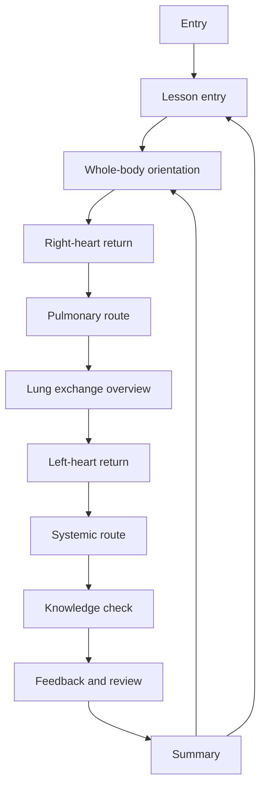

# AnatomIQ Lesson Experience Flow

| Field | Value |
| --- | --- |
| Document ID | AQ-UX-005 |
| Version | 0.1.0 |
| Status | Draft |
| Owner | AnatomIQ Project Team |
| Created | 2026-07-28 |
| Last updated | 2026-07-28 |
| Review cadence | Before wireframes, implementation, and prototype review |
| Related documents | [Information Architecture](INFORMATION_ARCHITECTURE.md), [Navigation Model](NAVIGATION_MODEL.md), [Interaction Model](INTERACTION_MODEL.md), [Accessibility Specification](ACCESSIBILITY_SPECIFICATION.md), [Content and Lesson Requirements](../03-PRD/CONTENT_AND_LESSON_REQUIREMENTS.md), [User Journeys](../03-PRD/USER_JOURNEYS.md) |

## Purpose

This document describes the cardiovascular lesson experience from entry to summary. It turns the product journey into a detailed flow that can guide wireframes, content placement, and prototype testing.

## Scope

### In scope

- Entry and orientation flow.
- Whole-body context to focused circulation story.
- Annotation and feedback moments.
- Knowledge-check and review flow.
- Summary and replay flow.

### Out of scope

- Final visual styling and brand treatment.
- Implementation-specific animation timings and code structure.
- Future body-system lessons beyond the cardiovascular MVP.

## Experience goals

- The learner should immediately understand what the lesson teaches.
- The lesson should move from body context to focused circulation without confusion.
- The learner should never lose the ability to pause, review, or return.
- Practice should reinforce the taught route rather than introduce unrelated content.

## Cardiovascular lesson flow

## Flow stages

### Entry

- Show the lesson title, objective, scope, and educational framing.
- Tell the learner this is an educational experience, not medical advice.
- Offer the primary action to start the cardiovascular lesson.

### Lesson entry

- Set expectations for level, scope, and control behavior.
- Surface reduced-motion and help access.
- Clarify what the lesson covers and what it does not.

### Whole-body orientation

- Show the learner where the heart and lungs sit in relation to the whole body.
- Establish the active system and the initial camera frame.
- Give the learner a stable sense of scale before flow begins.

### Right-heart return

- Show blood returning from the body into the right side of the heart.
- Identify the major chamber path with concise labels.
- Keep the learner oriented to direction, not just anatomy names.

### Pulmonary route

- Show blood leaving the heart toward the lungs.
- Explain why the pulmonary route is part of the loop.
- Keep colour as a cue, not the only source of meaning.

### Lung exchange overview

- Explain the oxygenation change in the simplified lesson model.
- Disclose the level of simplification used in the MVP.
- Link the lung step to the rest of the circulation loop.

### Left-heart return

- Show blood returning from the lungs to the left side of the heart.
- Reconnect the learner to the chamber sequence and naming.
- Preserve the lesson state if the learner opens details here.

### Systemic route

- Show blood leaving the left side toward the body.
- Use organs or broad body destinations as the visible context.
- Tie the flow to the broader purpose of circulation.

### Knowledge check

- Ask an objective-aligned question about the taught route.
- Provide answer options or controls that work through keyboard and reduced-motion paths.
- Give feedback that explains the reasoning behind the correct answer.

### Feedback and review

- Show the misconception or missing connection if the answer was wrong.
- Provide a direct link to the relevant lesson stage or annotation.
- Preserve question context so the learner can retry with understanding.

### Summary

- Recap the major route and key takeaways.
- Offer replay, review, system explorer, or exit actions.
- Reconfirm that the lesson was a formative educational experience.

## Screen and overlay expectations

| Stage | Must contain |
| --- | --- |
| Entry | Title, objective, scope, educational framing, start action |
| Lesson entry | Lesson level, route scope, control summary, help access |
| Orientation | Body context, active system, major structures, continue action |
| Flow stages | Current step, primary explanation, annotations, pause/replay controls |
| Knowledge check | Question, answer controls, submission, feedback path |
| Summary | Recap, replay/review actions, exit or system explorer action |

## Wireframe implications

- Each stage should be representable as a distinct frame or overlay.
- Controls must be placed consistently so the learner does not have to relearn the interface.
- Optional detail should be visually subordinate to the active story.
- Review and recovery actions must remain visible when the learner needs them most.

## Lesson experience acceptance criteria

- [ ] The learner can understand the lesson before starting the guided story.
- [ ] The learner can follow the full circulation route in a coherent sequence.
- [ ] The learner can pause, replay, review, and return without losing context.
- [ ] The knowledge check maps clearly to the taught content.
- [ ] The summary provides a meaningful exit and replay path.

## Open questions

- [ ] How many flow stages should be exposed in the first prototype versus collapsed into combined screens?
- [ ] Should the summary be a separate screen or part of the lesson shell?
- [ ] Which stages need persistent annotations and which can use transient overlays?

## Revision history

| Version | Date | Author/owner | Summary |
| --- | --- | --- | --- |
| 0.1.0 | 2026-07-28 | AnatomIQ Project Team | Initial cardiovascular lesson experience flow draft. |

## Review checklist

- [ ] The complete lesson flow is documented from entry to summary.
- [ ] Each stage has a clear learner goal and required content.
- [ ] Wireframe implications are specific enough to guide layout work.
- [ ] AI Context is current.

## AI Context

| Item | Value |
| --- | --- |
| Objective | Define the full cardiovascular lesson experience so wireframes and prototypes can follow a coherent flow. |
| Constraints | Keep the route educational, reviewable, and recoverable; do not add unrelated systems or unsupported content. |
| Inputs | Information Architecture, Navigation Model, Interaction Model, Accessibility Specification, Content and Lesson Requirements, User Journeys. |
| Outputs | Lesson stage flow, wireframe sequence, screen inventory, or prototype structure. |
| Do not assume | The lesson needs extra systems, hidden steps, or unreviewed clinical detail. |
| Validation | Check that every stage supports a clear learner goal and a safe path forward or back. |