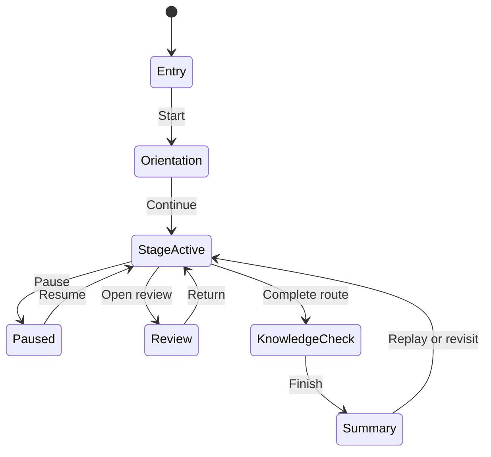

# AnatomIQ Lesson Engine

| Field | Value |
| --- | --- |
| Document ID | AQ-ENG-003 |
| Version | 0.1.0 |
| Status | Draft |
| Owner | AnatomIQ Project Team |
| Created | 2026-07-28 |
| Last updated | 2026-07-28 |
| Review cadence | Before implementation, major lesson flow changes, and release candidate review |
| Related documents | [System Architecture](SYSTEM_ARCHITECTURE.md), [Functional Requirements](../03-PRD/FUNCTIONAL_REQUIREMENTS.md), [Lesson Experience Flow](../04-UX/LESSON_EXPERIENCE_FLOW.md), [Interaction Model](../04-UX/INTERACTION_MODEL.md) |

## Purpose

This document defines the Lesson Engine. The engine controls stage progression, narrative flow, review behavior, and lesson-level state for AnatomIQ.

## Scope

### In scope

- Lesson stage sequencing.
- Replay, reset, and review behavior.
- Lesson lifecycle and progression state.
- Coordination between UI, data, and the Human Body Engine.

### Out of scope

- Medical content approval.
- Final component styling.
- Low-level routing or browser navigation mechanics.

## Engine responsibilities

- Load a lesson definition and initialize its stages.
- Progress the learner through approved stages in order.
- Manage pause, replay, review, and summary transitions.
- Coordinate lesson stage state with annotations, quizzes, and camera focus.

## Lesson lifecycle

## Engine rules

- The Lesson Engine must keep progression deterministic and recoverable.
- The engine must not skip undocumented stages.
- The engine must preserve context when opening annotations or feedback.
- The engine must support reduced-motion equivalents without changing the lesson’s objective.

## Engine boundaries

- The Lesson Engine owns lesson sequence and state.
- The Human Body Engine owns anatomical rendering.
- The Camera System, Scroll Engine, and Interaction Engine respond to lesson directives.
- The Data Model defines the lesson structure and content.

## Acceptance criteria

- [ ] The engine can run the cardiovascular MVP lesson from entry to summary.
- [ ] Stage progression, replay, and review are deterministic.
- [ ] State is preserved across pause and recoverable interactions.
- [ ] AI Context is current.

## Open questions

- [ ] Should the lesson engine interpret JSON lesson definitions directly or compile them into a richer runtime object?
- [ ] How much validation should happen at load time versus authoring time?
- [ ] What is the cleanest way to represent review links back into the lesson sequence?

## Revision history

| Version | Date | Author/owner | Summary |
| --- | --- | --- | --- |
| 0.1.0 | 2026-07-28 | AnatomIQ Project Team | Initial Lesson Engine draft for the engineering bible. |

## Review checklist

- [ ] Lifecycle and state transitions are explicit.
- [ ] Progression, replay, and review behavior are defined.
- [ ] Engine boundaries align with the architecture.
- [ ] AI Context is current.

## AI Context

| Item | Value |
| --- | --- |
| Objective | Define the lesson orchestration engine that controls progression, review, and summary behavior. |
| Constraints | Do not duplicate anatomical rendering logic or hide undocumented steps. |
| Inputs | System Architecture, Functional Requirements, Lesson Experience Flow, Interaction Model. |
| Outputs | Lesson lifecycle, sequencing rules, or state behaviors. |
| Do not assume | Navigation alone can replace lesson orchestration. |
| Validation | Confirm the engine can manage the full cardiovascular lesson loop predictably. |