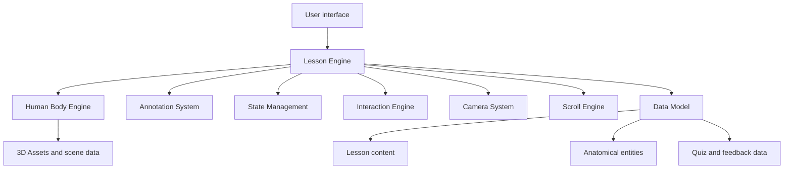

# AnatomIQ System Architecture

| Field | Value |
| --- | --- |
| Document ID | AQ-ENG-001 |
| Version | 0.1.0 |
| Status | Draft |
| Owner | AnatomIQ Project Team |
| Created | 2026-07-28 |
| Last updated | 2026-07-28 |
| Review cadence | Before implementation, major architecture changes, and release candidate review |
| Related documents | [Product Requirements Document](../03-PRD/PRODUCT_REQUIREMENTS_DOCUMENT.md), [Functional Requirements](../03-PRD/FUNCTIONAL_REQUIREMENTS.md), [Lesson Experience Flow](../04-UX/LESSON_EXPERIENCE_FLOW.md), [Design Vision](../05-Design/DESIGN_VISION.md) |

## Purpose

This document defines the overall architecture of AnatomIQ. It explains how the platform is organized so the reusable Human Body Engine, lesson engine, content model, and delivery pipeline can evolve without hardcoding the cardiovascular MVP into a dead-end implementation.

## Scope

### In scope

- High-level application architecture.
- Engine boundaries and responsibility split.
- Data-driven lesson delivery structure.
- Relationship between content, UI, and 3D presentation.

### Out of scope

- Framework-specific implementation details.
- Low-level code structure inside individual components.
- Final hosting or infrastructure provider selection.

## Architecture goals

- Keep the cardiovascular MVP reusable for later body systems.
- Separate content from shared behavior.
- Preserve learner state across lesson interactions.
- Support accessibility, performance, and recoverability from the start.

## System view

## Architectural principles

- The application must be content-driven, not hardcoded around one lesson.
- Shared behavior must live in reusable engines and systems.
- Lesson data must describe what happens, while engines describe how it happens.
- Fallbacks must exist for reduced motion, accessibility, and asset failure.

## Core layers

| Layer | Responsibility |
| --- | --- |
| Presentation | Render lesson UI, overlays, and stage content |
| Lesson orchestration | Sequence stages, manage route state, trigger review and summary |
| Human Body Engine | Present anatomical systems, structures, and visual context |
| Interaction layer | Handle scroll, click, keyboard, hover, and drag behaviors |
| Data layer | Store lesson steps, annotations, quizzes, structures, and states |
| Asset layer | Supply models, textures, audio, and other media |

## Architectural rules

- The cardiovascular MVP must validate the reusable architecture, not bypass it.
- Any new body system should be added mostly through data and content.
- Engine boundaries must remain clear enough that lessons do not become special cases.
- Accessibility and recovery behavior are part of architecture, not afterthoughts.

## Architecture acceptance criteria

- [ ] The system is clearly split into reusable engines and content data.
- [ ] The cardiovascular lesson can be delivered without hardcoding lesson flow in one-off UI logic.
- [ ] The architecture supports future body systems.
- [ ] AI Context is current.

## Open questions

- [ ] How much of the lesson shell should live in the lesson engine versus the presentation layer?
- [ ] What data boundaries are needed to let medical content be edited without code changes?
- [ ] Should the engine be built as a package from the start or remain internal until the MVP proves it?

## Revision history

| Version | Date | Author/owner | Summary |
| --- | --- | --- | --- |
| 0.1.0 | 2026-07-28 | AnatomIQ Project Team | Initial system architecture draft for the engineering bible. |

## Review checklist

- [ ] Architectural layers and boundaries are defined.
- [ ] The reusable lesson model is explicit.
- [ ] Accessibility and recovery are treated as architectural concerns.
- [ ] AI Context is current.

## AI Context

| Item | Value |
| --- | --- |
| Objective | Define the top-level architecture for AnatomIQ so later engineering work stays reusable and data-driven. |
| Constraints | Do not hardcode the cardiovascular MVP as a one-off app; preserve shared engine boundaries and accessibility support. |
| Inputs | Product Requirements Document, Functional Requirements, Lesson Experience Flow, Design Vision. |
| Outputs | Architecture boundaries, system layers, or implementation guidance. |
| Do not assume | A single framework component tree is enough to express the platform architecture. |
| Validation | Confirm the architecture supports a future second system mainly through content and data changes. |